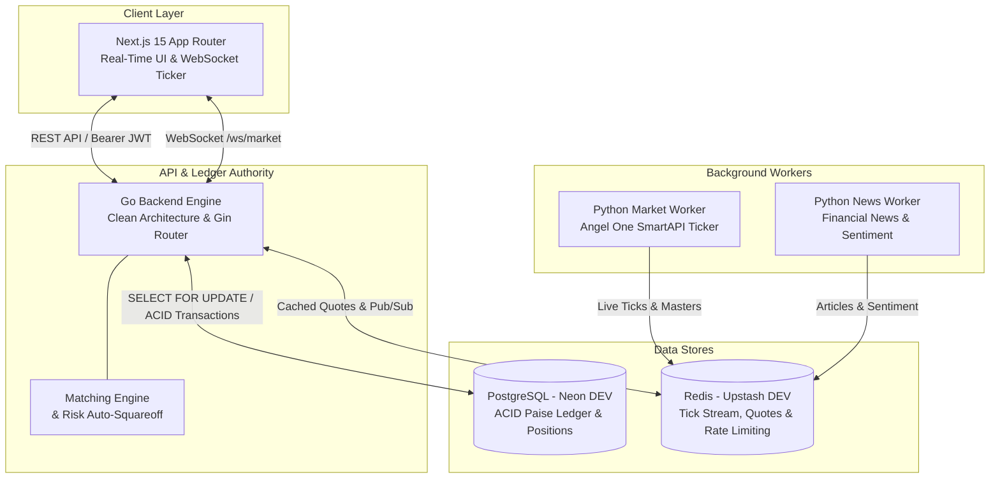

# Stock Simulator 📈

A production-grade Indian market paper trading simulator and real-time execution engine. Designed for realistic simulation of the National Stock Exchange (NSE) and Bombay Stock Exchange (BSE), the platform models live market data, strict session timings, integer-paise financial precision, intraday leverage, derivative contract settlement, and automated risk management.

---

## 🏛️ System Architecture

The platform follows a clean distributed microservices architecture separating client presentation, transactional ledger authority, and real-time market data ingestion:



### Component Responsibilities
- **Frontend (`frontend/`)**: Next.js 15 (TypeScript, React, Tailwind CSS) providing responsive trading dashboards, live watchlist tickers, order ticket modals, and interactive P&L charts. Pure presentation layer with zero business or financial logic authority.
- **Backend (`backend/`)**: High-performance Go service acting as the central ledger authority, pre-trade validator, limit order matching engine, and automated risk manager.
- **Market Worker (`python-services/market-worker/`)**: Python service connecting to Angel One's SmartAPI WebSocket feed, streaming live market quotes, and updating instrument masters into Redis and PostgreSQL.
- **News Worker (`python-services/news-worker/`)**: Scrapes and ingests live market sentiment and headlines into Redis.
- **PostgreSQL**: Primary transactional database storing users, orders, trades, positions, and double-entry wallet transactions.
- **Redis**: Low-latency cache storing live quotes, market ticks, rate-limiting counters, and real-time pub/sub channels.

---

## 💎 Core Financial & Trading Invariants

### 1. Zero Floating-Point Precision (Integer Paise)
All financial figures—including cash balances, margins, stock prices, trade turnovers, and realized/unrealized P&L—are tracked exclusively in **integer paise** ($1\text{ INR} = 100\text{ paise}$) using 64-bit integers (`int64`). Floating-point arithmetic is strictly prohibited across the database and Go ledger to eliminate rounding drift.

### 2. Strict Indian Market Session Validation (09:15 – 15:30 IST)
The backend enforces Indian Standard Time (IST, UTC+5:30) trading hours:
- **Trading Hours**: Orders are strictly accepted only between **09:15:00 IST** and **15:30:00 IST**, Monday through Friday.
- **Weekend & Holiday Rejection**: Orders placed on Saturdays, Sundays, or recognized exchange trading holidays are immediately rejected with descriptive rejection notices.

### 3. Product Types & Margin Rules
- **Delivery (`CNC`)**: Long-only equity investing. Requires 100% upfront cash. Selling requires pre-existing holdings (`SELECT FOR UPDATE` verification); short selling in delivery mode is blocked.
- **Intraday (`MIS`)**: 5x leverage ($20\%$ initial margin requirement). Long and short intraday positions supported.
  - **15:20 IST**: All open MIS limit orders are automatically cancelled to release reserved margin.
  - **15:20 – 15:30 IST**: Unliquidated intraday positions are systematically squared off at market price.
  - **15:30 IST**: Market close hard stop; any unfillable positions record audit risk events (`status = 'FAILED'`).
- **Derivatives (`NRML`)**: Futures and Options contracts with exchange lot sizing.
  - **Option Buys**: $100\%$ premium blocked upfront.
  - **Futures / Option Sells**: Span and exposure margin blocked.
  - **Expiry Settlement (15:30 IST)**: Expired contracts are settled via European-style cash settlement against the underlying cash index close (e.g. NIFTY / BANKNIFTY). In-the-money options receive cash intrinsic value; out-of-the-money contracts expire worthless with margin released.

### 4. Position Crossing & Net Reversals
The execution engine supports seamless position reversals across zero. For example, submitting a SELL order of 150 shares when holding +100 shares long will atomically close the 100 long shares (realizing P&L), transition across flat (quantity 0), open a -50 short position, and adjust required margin in a single ACID transaction.

### 5. Deadlock-Free Row-Locking Hierarchy
To eliminate database deadlocks under high-concurrency order placement and risk liquidation, transactions acquire row-level locks in this deterministic order:
$$\text{Wallets} \longrightarrow \text{Positions} \longrightarrow \text{Orders}$$

### 6. Decoupled Portfolio Valuation
Portfolio display endpoints (`/portfolio`, `/portfolio/positions`, `/portfolio/pnl`) utilize resilient multi-tier price fallback (`CurrentQuote()`), allowing users to inspect their portfolio and P&L outside trading hours or when markets are closed without triggering stale-quote errors. Live trade matching strictly requires fresh `ExecutableQuote()` ticks.

---

## 📁 Repository Structure

```
Stock-Simulator/
├── backend/                      # Go Backend Ledger Authority
│   ├── cmd/server/               # Application entrypoint
│   ├── internal/
│   │   ├── app/                  # Lifecycle bootstrap & graceful shutdown
│   │   ├── auth/                 # JWT authentication & session management
│   │   ├── config/               # Environment configuration loader
│   │   ├── database/             # PostgreSQL GORM connection
│   │   ├── market/               # Market data service, calendar & quotes
│   │   ├── model/                # GORM entity models & paise ledger schemas
│   │   ├── order/                # Order matching, execution & risk services
│   │   ├── portfolio/            # Valuation & portfolio balance calculations
│   │   ├── product/              # CNC, MIS & NRML margin rules
│   │   ├── router/               # Gin routes & worker context orchestration
│   │   └── simulation/           # Atomic portfolio reset service
│   ├── Dockerfile                # Multi-stage production container build
│   └── go.mod
├── frontend/                     # Next.js 15 Web Application
│   ├── src/app/                  # App Router pages & dashboards
│   ├── src/components/           # Trading widgets, modals & charts
│   └── package.json
├── python-services/              # Real-Time Ingestion Workers
│   ├── market-worker/            # Angel One SmartAPI WebSocket streamer
│   └── news-worker/              # Market news scraper & sentiment analyzer
├── docs/                         # Specifications & Technical Architecture
│   ├── api/openapi.yaml          # Complete OpenAPI 3.0.3 specification
│   ├── database/schema.md        # Database tables, indexes & state machines
│   ├── cache-policy.md           # Redis caching & TTL guidelines
│   └── deployment.md             # Production deployment instructions
├── docker-compose.yml            # Development Docker Compose
└── docker-compose.prod.yml       # Production Docker Compose with healthchecks
```

---

## 🚀 Getting Started

### Prerequisites
- **Go**: `1.24+`
- **Node.js**: `20+` & `npm`
- **Python**: `3.11+`
- **Docker & Docker Compose**

### 1. Environment Setup
Clone the repository and prepare your environment configuration:

```bash
# Clone the repository
git clone https://github.com/Dhiraj10002/Stock-Simulator.git
cd Stock-Simulator

# Configure backend environment
cp backend/.env.example backend/.env
```

Ensure `backend/.env` contains your PostgreSQL database URL and Redis credentials. By default, development connects seamlessly to **Neon DEV PostgreSQL** and **Upstash DEV Redis**.

---

### 2. Running Locally (Development Mode)

#### Running the Go Backend
```bash
cd backend
go run ./cmd/server
```
The backend will automatically apply migrations and start listening on `http://localhost:8080`.

#### Running the Next.js Frontend
```bash
cd frontend
npm install
npm run dev
```
Open `http://localhost:3000` to access the trading interface.

#### Running Python Workers
```bash
# Market Data Streamer
cd python-services/market-worker
pip install -r requirements.txt
python main.py

# News Sentiment Worker
cd ../news-worker
pip install -r requirements.txt
python main.py
```

---

### 3. Running with Docker Compose

#### Option A: Managed Cloud DB (Default)
Connects the containerized backend and workers to your configured Neon DEV and Upstash DEV instances:
```bash
docker compose up --build
```

#### Option B: Fully Local Infrastructure
Starts local containerized PostgreSQL and Redis services along with the backend:
```bash
docker compose --profile local up --build
```

---

## 🧪 Testing & Verification

The backend includes a comprehensive suite of unit tests, concurrent stress tests, and integration tests validated against PostgreSQL:

```bash
# Run all backend unit & integration tests
cd backend
go test -v -count=1 ./...

# Run static analysis and vet
go vet ./...

# Verify code formatting
test -z "$(gofmt -l .)" && echo "Code formatting is clean!"
```

### Key Test Suites
- `calendar_test.go`: 09:15–15:30 IST session boundary, weekend, and holiday rejection.
- `concurrency_integration_test.go`: Multi-threaded simultaneous orders validating deadlock-free locking.
- `position_crossing_integration_test.go`: Long-to-short and short-to-long net position reversals across zero.
- `mis_squareoff_test.go`: 15:20 order cancellations and 15:20–15:30 retry loop auto-squareoff.
- `fno_expiry_integration_test.go`: 15:30 IST derivatives expiry cash settlement and intrinsic value calculations.
- `app_test.go`: Graceful `SIGINT`/`SIGTERM` server shutdown with background worker context propagation.

---

## 📖 Documentation & Specifications

- **[OpenAPI 3.0 Specification](file:///home/dhiraj/personal/Stock-Simulator/docs/api/openapi.yaml)**: Comprehensive interactive REST API & WebSocket documentation.
- **[Database Schema & Ledger Architecture](file:///home/dhiraj/personal/Stock-Simulator/docs/database/schema.md)**: Tables, columns, indexes, constraints, and state machine diagrams.
- **[Cache Policy](file:///home/dhiraj/personal/Stock-Simulator/docs/cache-policy.md)**: Redis quote caching, expiry policies, and pub/sub channels.
- **[Production Deployment Guide](file:///home/dhiraj/personal/Stock-Simulator/docs/deployment.md)**: Container orchestration, healthcheck probes, and security hardening.

---

## ⚖️ License
Distributed under the MIT License. See `LICENSE` for details.
