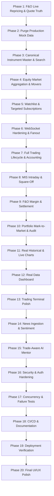

# Stock Simulator — Master Plan Analysis, List of DO's & Step-by-Step Execution Guide

> **Authoritative Reference & Source of Truth**  
> **Repository:** `Dhiraj10002/Stock-Simulator`  
> **Consolidated Target:** Indian Market Paper-Trading Platform (NSE / BSE / NFO)  
> **Guiding Principle:** *Never make fake market data look real. If real data is unavailable, expose that it is unavailable.*

---

## 1. Executive Analysis & Repository Review

### 1.1 Master Plan vs. Existing Codebase Audit
A thorough audit of the repository (`git log`, `backend`, `python-services`, `frontend`, `docs`) reveals that the project is significantly advanced and has already addressed several major architectural risks:

1. **Architecture Preserved:**
   - **Backend:** Go (Gin, GORM, gorilla/websocket) handles authentication, order lifecycle, execution matching, wallet transactions, and risk controls.
   - **Database & Cache:** PostgreSQL (Neon) stores permanent business truth (users, orders, trades, positions, ledger, refresh sessions); Redis (Upstash) serves as the authoritative live quote and candle store.
   - **Market Worker:** Python worker (`python-services/market-worker/worker.py`) interfaces with Angel One SmartAPI / SmartWebSocketV2, normalizes incoming ticks, generates 1-minute OHLC candles, updates Redis hashes (`market:quote:<symbol>`), feeds list history (`market:history:<symbol>`), and publishes updates to `market:updates`.
   - **Frontend:** Next.js (TypeScript, Tailwind CSS, lightweight-charts, Zustand, TanStack Query). The monolithic `trading-terminal.tsx` has been modularized into domain-driven pages (`/trade`, `/portfolio`, `/orders`, `/watchlist`, `/analytics`, `/mentor`, `/options`).

2. **Recent Implementations Already in Codebase:**
   - **Feed Modes & Taxonomy:** `backend/internal/market/dto/taxonomy.go` defines explicit `FeedMode` (`LIVE`, `SYNTHETIC`, `UNAVAILABLE`) and `QuoteSource` (`angelone_live`, `synthetic_gbm`, `fno_engine`, `seed`, `unavailable`).
   - **Redis Quote Authority:** `backend/internal/market/service/redis.go` reads directly from Redis, enforces freshness (< 2 minutes), blocks seeded quotes in production flow, checks feed availability, and avoids read-time generation.
   - **Contract Specifications & Validation:** `backend/internal/product/contract_spec.go` implements standard Indian exchange lot sizes (NIFTY 25, BANKNIFTY 15, FINNIFTY 25, etc.) and tick sizes (5 paise = ₹0.05).
   - **F&O Correctness & Margin Rules:** `backend/internal/order/service/fno_correctness_test.go` and `backend/internal/product/` enforce 6 trading directions (CE Buy/Sell, PE Buy/Sell, Future Buy/Sell) and settlement intrinsic calculations.
   - **Observability & Logging Sanitizer:** `backend/pkg/logger/sanitizer.go` and `python-services/market-worker/worker.py` redact JWTs, Bearer tokens, and private API keys from logs.

3. **Critical Identified Gaps to Guard Against:**
   - **Portfolio Silent Fallback:** In `backend/internal/portfolio/service/portfolio_service.go`, when a live quote is missing, it currently falls back to `position.CurrentPricePaise` or `position.AveragePricePaise` (cost basis), effectively resetting unrealized P&L to zero instead of reporting an explicit `unavailable` or `stale` quote status.
   - **Frontend Placeholder Handling:** The UI components must consistently show badge indicators (`UNAVAILABLE`, `STALE`, `MARKET CLOSED`) rather than rendering `₹0.00` or neutral zeroes when feeds are disconnected.
   - **Provider Verification & Credentials:** When live Angel One credentials are absent, the system must clearly report that live-provider ingestion is blocked/disconnected, rather than simulating ticks under the label `angelone_live`.

---

## 2. Definitive List of DO's (and DO NOT's)

### 2.1 Architecture & Infrastructure
- [x] **DO** preserve the existing architecture: Next.js frontend $\rightarrow$ Go Gin backend $\rightarrow$ Neon PostgreSQL (durable truth) & Upstash Redis (live quotes) $\leftarrow$ Python workers (Angel One / RSS News).
- [x] **DO** keep the development / deployment split: local dev on laptop connecting to Dev Neon + Dev Upstash; production on Oracle VM (Go + Python) + Vercel (Next.js) connecting to Prod Neon + Prod Upstash.
- [x] **DO** fail closed: if production environment variables (`NEXT_PUBLIC_API_URL`, `NEXT_PUBLIC_WS_URL`, `DATABASE_URL`, `REDIS_URL`) are missing or misconfigured, abort startup immediately with a clear error.
- [ ] **DO NOT** introduce local PostgreSQL or Redis as required local infrastructure.
- [ ] **DO NOT** add paid infrastructure or services without prior verification and explicit approval.
- [ ] **DO NOT** route production browser requests to `window.location.origin/api/v1` if that could route to Vercel instead of the Go backend.

### 2.2 Market Truth & Feed Provenance
- [x] **DO** enforce strict, explicit Feed Modes: `LIVE`, `SYNTHETIC`, `UNAVAILABLE`.
- [x] **DO** enforce standard Quote Source taxonomy:
  - `angelone_live`: Real provider tick.
  - `synthetic_gbm`: Explicit simulation/test mode only.
  - `fno_engine`: Deliberate internal F&O valuation engine only; never labeled as provider live data.
  - `seed`: Development/test fixtures only.
  - `unavailable`: No valid quote available.
- [x] **DO** ensure `LIVE` mode fails closed: if Angel One or Redis fails, feed status transitions to `UNAVAILABLE` or `DISCONNECTED`.
- [ ] **DO NOT** silently fall back from `LIVE` to `SYNTHETIC`.
- [ ] **DO NOT** hide missing market data behind random numbers, simulated GBM, fake candles, or static percentages in production flows.
- [ ] **DO NOT** represent missing market data as `price = 0`. Use explicit error states (`QUOTE_NOT_FOUND`, `QUOTE_STALE`, `MARKET_UNAVAILABLE`).

### 2.3 Redis as Authoritative Live Quote Store
- [x] **DO** read live quotes directly from Redis keys (`market:quote:<SYMBOL>`).
- [x] **DO** validate quote timestamp and freshness on every quote read:
  - Fresh: Age within configured executable threshold ($\le 120$s).
  - Stale: Age older than threshold $\rightarrow$ return `ErrQuoteStale`.
  - Missing: Redis key does not exist $\rightarrow$ return `ErrQuoteNotFound`.
- [x] **DO** keep `CurrentQuote(symbol)` strictly read-only.
- [ ] **DO NOT** perform read-time mutation (e.g. "GET quote $\rightarrow$ missing $\rightarrow$ create seed price $\rightarrow$ write Redis $\rightarrow$ return price").
- [ ] **DO NOT** rely on synchronous HTTP worker rescue fallbacks during order execution or portfolio valuation.

### 2.4 Canonical Instrument Master & Identity
- [x] **DO** use canonical Angel One tokens and exchange segments (`NSE`, `NFO`, `BSE`) as the single source of truth for instruments.
- [x] **DO** resolve all F&O contracts to canonical identity: `exchange`, `token`, `tradingSymbol`, `underlying`, `expiry`, `strike`, `optionType` (CE/PE), `instrumentType` (OPTIDX, OPTSTK, FUTIDX, FUTSTK), `lotSize`, and `tickSize`.
- [x] **DO** support deterministic alias normalization (e.g. `PRAJIND` $\rightarrow$ canonical token $\rightarrow$ Redis key) consistently across Frontend, Go, and Python.
- [ ] **DO NOT** fabricate derivative contracts from display strings (e.g., never assume `RELIANCE 2500 CE` exists without validating canonical instrument master).

### 2.5 Trading Engine, Accounting & Invariants
- [x] **DO** fetch authoritative execution prices server-side from Redis at the exact time of order fill.
- [x] **DO** store and compute all monetary values in integer **paise** ($1 \text{ Rupee} = 100 \text{ paise}$) with 64-bit integer overflow protection.
- [x] **DO** wrap order validation, cash reservation, trade creation, position updates, and wallet debit/credit in a single ACID PostgreSQL database transaction.
- [x] **DO** separate product semantics cleanly:
  - `DELIVERY` (CNC): Full cash required, long-only, zero leverage, no auto square-off.
  - `INTRADAY` (MIS): Leverage multiplier applied, mandatory square-off before 3:20 PM IST.
  - `FNO`: Contract lot size and tick size enforced, explicit margin for short options/futures, premium debit for long options.
- [x] **DO** maintain strict wallet invariants: `available_balance + blocked_balance = cash_balance`.
- [x] **DO** record immutable audit records (`Trade`, `WalletTransaction`, `RefreshSession`) for every balance change.
- [ ] **DO NOT** allow client-specified fill prices. Limit order price is an execution condition, never the fill price.
- [ ] **DO NOT** let an F&O `SELL` consume an equity delivery holding.
- [ ] **DO NOT** delete order history or trade records during normal operations; reset must be an explicit, isolated simulation endpoint.

### 2.6 Portfolio Valuation & Mark-to-Market
- [x] **DO** compute mark-to-market valuations from authoritative current quotes:
  $$\text{Current Value} = |\text{Quantity}| \times \text{Current Quote}$$
  $$\text{Unrealized P\&L (Long)} = (\text{Current Quote} - \text{Average Price}) \times \text{Quantity}$$
  $$\text{Unrealized P\&L (Short)} = (\text{Average Price} - \text{Current Quote}) \times |\text{Quantity}|$$
- [x] **DO** expose explicit `is_stale` or `is_unavailable` flags on positions when current quotes are not fresh.
- [ ] **DO NOT** fall back to cost basis (making P&L ₹0) when quotes are missing. Mark the valuation status as `UNAVAILABLE`.

### 2.7 Execution & Development Workflow
- [x] **DO** implement only one phase at a time in the exact recommended phase order.
- [x] **DO** inspect the repository first (`git status`, `git log`, inspect relevant modules) before writing code.
- [x] **DO** verify existing features before assuming they are missing.
- [x] **DO** run automated tests across backend (`go test ./...`), python (`unittest`), and frontend (`npm run lint && npx tsc --noEmit`) after every change.
- [x] **DO** document each completed phase using the standardized Phase Completion Report template (Section 39).
- [ ] **DO NOT** redesign the UI before the underlying data pipelines, execution engine, and accounting invariants are verified.
- [ ] **DO NOT** mark a phase complete if any acceptance criteria or tests fail.

---

## 3. Step-by-Step 20-Phase Master Roadmap

### Phase 1: F&O Live Repricing + Market Truth (START HERE)
- **Objective:** Prove and enforce the complete live market pipeline from Angel One $\rightarrow$ Python Worker $\rightarrow$ Redis $\rightarrow$ Go `CurrentQuote()` $\rightarrow$ F&O Portfolio Valuation $\rightarrow$ Next.js UI.
- **Key Tasks:**
  1. Fix `PortfolioService.Get()` in Go: do not fall back to average cost basis when quotes are missing; return explicit quote availability flags.
  2. Enforce canonical F&O contract identity across worker and backend.
  3. Ensure `CurrentQuote()` is 100% read-only with timestamp validation and explicit errors (`QUOTE_NOT_FOUND`, `QUOTE_STALE`, `MARKET_DATA_UNAVAILABLE`).
  4. Verify Long/Short CE, PE, and Futures P&L tests.
- **Acceptance Criteria:**
  - Redis is authoritative for live quotes.
  - Zero read-time mutations or auto-generated prices.
  - Missing and stale quotes produce explicit error/unavailable states rather than zero placeholders.
  - All 6 F&O trading action P&L tests pass.

### Phase 2: Remove Production Mock/Demo Data
- **Objective:** Audit and eliminate all production-flow mock, dummy, Math.random, or fake pricing data.
- **Key Tasks:**
  1. Classify occurrences in `frontend/src/` into `PRODUCTION`, `TEST`, `DEV ONLY`, `UNUSED`.
  2. Remove mock stock lists and fallback cards from user-facing trading paths.
  3. Replace fake depth cards with real WebSocket depth or explicit "Depth Unavailable" indicators.
- **Acceptance Criteria:**
  - Zero random prices or synthetic fallbacks in production routes.

### Phase 3: Canonical Instrument Master + Search
- **Objective:** Build deterministic instrument master synchronization from Angel One OpenAPIScripMaster.
- **Key Tasks:**
  1. Download, parse, and store official Angel One scrip master.
  2. Index exchange segments (`NSE`, `NFO`, `BSE`), tokens, lot sizes, tick sizes, strike prices, and expiries.
  3. Wire `/api/v1/instruments` and `/api/v1/stocks` to search only canonical instruments.
- **Acceptance Criteria:**
  - No fabricated contracts. Only canonical exchange tokens are searchable and tradable.

### Phase 4: Equity Market Aggregation
- **Objective:** Implement backend aggregation algorithms for market movers.
- **Key Tasks:**
  1. Top Gainers & Losers: computed dynamically from valid quotes in configured equity universe.
  2. Most Traded: ranked by accumulated volume/turnover.
  3. Trending: calculated using transparent, documented price-momentum/volatility formula.
  4. Market Breadth: advances, declines, unchanged count.
- **Acceptance Criteria:**
  - Market mover endpoints return real computed values or empty/unavailable states; never static mock arrays.

### Phase 5: Watchlist + Targeted Subscriptions
- **Objective:** Centralize dynamic client WebSocket subscriptions based on active user view.
- **Key Tasks:**
  1. User adds/removes symbols to DB-backed watchlist.
  2. Client subscribes only to active watchlist symbols + currently viewed stock/chart.
  3. Prevent huge unbounded global subscription lists.
- **Acceptance Criteria:**
  - Browser WebSocket sends targeted subscribe/unsubscribe messages as user navigates.

### Phase 6: WebSocket Hardening
- **Objective:** Ensure rock-solid real-time streaming to the browser.
- **Key Tasks:**
  1. Gorilla WebSocket configuration: read/write deadlines, ping/pong heartbeats.
  2. Slow-client detection with bounded channel buffers; drop slow consumers without blocking Redis Pub/Sub.
  3. Origin check against configured CORS allowlist.
- **Acceptance Criteria:**
  - A slow or hanging browser client does not block feeds for other users or crash the backend.

### Phase 7: Complete Trading Lifecycle
- **Objective:** Validate end-to-end order execution and state transitions.
- **Key Tasks:**
  1. Market and limit order placement with cash reservation.
  2. Order matching against authoritative Redis quote.
  3. Atomic execution: position update, trade creation, wallet debit/credit in single PostgreSQL transaction.
  4. Cancellation releasing reserved funds.
- **Acceptance Criteria:**
  - Idempotent execution, zero balance drift, zero orphaned reservations.

### Phase 8: MIS / Intraday Lifecycle
- **Objective:** Implement intraday margin multiplier and automated square-off.
- **Key Tasks:**
  1. Configurable leverage (e.g. $5\times$).
  2. Scheduled job triggering auto square-off at 3:20 PM IST on trading days.
  3. Idempotent square-off preventing double fills.
- **Acceptance Criteria:**
  - Open MIS positions square off automatically at cutoff; manual square-off remains safe under concurrency.

### Phase 9: F&O Margin + Settlement
- **Objective:** Comprehensive derivative risk and expiry settlement.
- **Key Tasks:**
  1. Margin calculation for futures and option sellers; premium debit for option buyers.
  2. Expiry day settlement using authoritative underlying spot close price.
  3. Cash settlement of ITM options and futures; OTM options expire worthless.
- **Acceptance Criteria:**
  - Accurate settlement realized P&L credited to wallet; settlement price persisted for auditing.

### Phase 10: Portfolio Accounting + Audit History
- **Objective:** Exact accounting for invested capital, realized/unrealized P&L, and audit logs.
- **Key Tasks:**
  1. Cost basis preservation during partial position unwinding.
  2. Complete transaction history in `wallet_transactions` and `trades`.
  3. Reports: Contract Note and Ledger Statement endpoints.
- **Acceptance Criteria:**
  - All portfolio totals match ledger history down to the exact paisa.

### Phase 11: Historical & Live Charts
- **Objective:** Professional TradingView lightweight-charts integration.
- **Key Tasks:**
  1. Fetch 1-minute historical candles from Redis or worker archive.
  2. Stream live tick updates into current open candle.
  3. Graceful handling of missing history (show explicit unavailable state, no fake candles).
- **Acceptance Criteria:**
  - Charts render real OHLC candles; live price bar updates on WebSocket tick.

### Phase 12: Real Data Dashboard
- **Objective:** Connect the main dashboard to backend market aggregations.
- **Key Tasks:**
  1. Indices bar (NIFTY, BANKNIFTY, SENSEX).
  2. Movers cards (Gainers, Losers, Most Active).
  3. Portfolio summary snapshot and market open/closed status banner.
- **Acceptance Criteria:**
  - Zero hardcoded market numbers on the dashboard.

### Phase 13: Trading Terminal Refactor & Polish
- **Objective:** High-density, professional trading desk UX.
- **Key Tasks:**
  1. Cohesive 3-panel layout: Watchlist $\mid$ Chart $\mid$ Order Ticket + Bottom Positions/Orders table.
  2. Keyboard shortcuts, quick order entry, and responsive layout.
- **Acceptance Criteria:**
  - Fast, intuitive terminal layout suitable for active paper-trading.

### Phase 14: News Ingestion & Sentiment
- **Objective:** Real Indian financial news ingestion and sentiment analysis.
- **Key Tasks:**
  1. Python news worker polling official RSS feeds.
  2. Lexical scoring and symbol tagging stored in Redis.
  3. Go API `/api/v1/news` and frontend news desk.
- **Acceptance Criteria:**
  - Headlines link to real sources; sentiment is transparently classified.

### Phase 15: Trade-Aware AI Mentor
- **Objective:** Server-side Gemini AI mentor offering educational trade critiques.
- **Key Tasks:**
  1. Backend-only integration (`POST /api/v1/ai/analyze-trade`).
  2. Contextual injection of user's recent trades and risk stats into Gemini prompt.
  3. Educational guidance without financial advice or guarantees.
- **Acceptance Criteria:**
  - Gemini API key never exposed to client; structured JSON educational critique rendered in UI.

### Phase 16: Security Hardening
- **Objective:** Complete authentication, authorization, and network security.
- **Key Tasks:**
  1. Transactional refresh token rotation with JTI tracking.
  2. Strict CORS allowlist for production domains.
  3. Redis token bucket rate limiting on auth and write routes.
  4. Response sanitization preventing leakage of hashes or keys.
- **Acceptance Criteria:**
  - Automated security tests pass; rate limits prevent brute force.

### Phase 17: Concurrency & Failure Stress Testing
- **Objective:** Verify system resilience under race conditions and upstream outages.
- **Key Tasks:**
  1. Concurrent order creation vs. wallet reset.
  2. Redis disconnection and reconnection handling.
  3. Upstream market provider disconnect and recovery.
- **Acceptance Criteria:**
  - Zero double-spending, zero orphaned database locks, graceful recovery.

### Phase 18: CI/CD + Documentation
- **Objective:** Enforce quality gates and keep documentation in sync.
- **Key Tasks:**
  1. GitHub Actions CI running `go test`, `npm run lint`, `npx tsc`, and python checks without swallowing errors.
  2. OpenAPI / Swagger documentation matching implemented endpoints.
- **Acceptance Criteria:**
  - Green CI pipeline; accurate README and architecture guides.

### Phase 19: Deployment Verification
- **Objective:** Live verification on Oracle VM + Vercel + Neon + Upstash.
- **Key Tasks:**
  1. Deploy Go backend and Python workers on Oracle VM via Docker / systemd.
  2. Deploy Next.js frontend to Vercel.
  3. Verify TLS, WebSocket connectivity, and end-to-end trade execution on production URLs.
- **Acceptance Criteria:**
  - Production paper-trading flows operate cleanly with zero mock dependencies.

### Phase 20: Final UI/UX Polish
- **Objective:** Visual excellence and modern Indian trading aesthetics (Groww/Kite inspired).
- **Key Tasks:**
  1. Polished dark mode, curated color tokens, crisp typography.
  2. Clear feed status banners (`LIVE FEED`, `SIMULATED MODE`, `MARKET CLOSED`).
- **Acceptance Criteria:**
  - Clean, responsive, and trustworthy trading interface.

---

## 4. Phase 1 Immediate Action Plan & Checklist

### 4.1 Goal
Prove and harden the complete live F&O path:
$$\text{Angel One / Redis} \longrightarrow \text{Go CurrentQuote()} \longrightarrow \text{F\&O Valuation} \longrightarrow \text{P\&L Calculation} \longrightarrow \text{Frontend Display}$$

### 4.2 Phase 1 Checklist
- [ ] **Audit & Refactor `PortfolioService.Get()`:**
  - Replace silent fallback to `position.AveragePricePaise` when quotes are missing with explicit quote status (`is_quote_available: false`).
  - Calculate unrealized P&L only when a valid, positive quote exists.
- [ ] **Verify Canonical Identity Resolution:**
  - Validate that `product.ParseSyntheticFNOContract()` and `product.StandardContractSpecs` match official instrument specifications.
- [ ] **Validate Redis Quote Read-Only Invariant:**
  - Confirm `CurrentQuote()` never writes or seeds prices into Redis.
- [ ] **Run F&O P&L Correctness Suite:**
  - Execute `backend/internal/order/service/fno_correctness_test.go` and `portfolio_service_test.go`.
- [ ] **Frontend Stale/Unavailable Quote Indication:**
  - Check `frontend/src/app/(trading)/portfolio/page.tsx` and ensure positions with missing quotes show an "Unavailable" badge rather than ₹0.00 P&L.
- [ ] **Generate Phase 1 Completion Report:**
  - Fill out Section 39 template with test logs and runtime verification.
