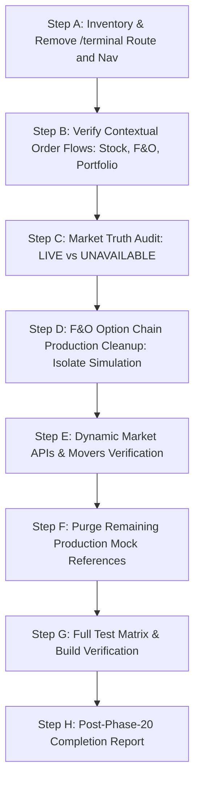

# Stock Simulator — Master Plan Analysis, List of DO's & Step-by-Step Execution Guide

> **Authoritative Reference & Source of Truth**  
> **Repository:** `Dhiraj10002/Stock-Simulator`  
> **Branch:** `main`  
> **Consolidated Target:** Indian Market Paper-Trading Platform (NSE / BSE / NFO)  
> **Guiding Principle:** *Never make fake market data look real. If real data is unavailable, expose that it is unavailable.*

---

## 1. Executive Analysis & Repository Review

### 1.1 Master Plan vs. Existing Codebase Audit
A thorough audit of the repository (`git log`, `backend`, `python-services`, `frontend`, `docs`) confirms that all initial 20 phases have been implemented and committed:
- **Commits `e690e73` through `863c7eb`:** Completed core phases including integer paise accounting, portfolio valuation, trading view charts, news desk, AI trading mentor, security hardening (transactional JTI token rotation, Redis token bucket rate limiting, CORS), concurrency/failure stress testing (15 vectors), CI/CD hardening, live OpenAPI 3.0 specification serving, deployment verification, and authoritative Groww/Kite-inspired UI/UX banners.
- **Commit `a362c7d`:** Formally audited and marked the initial Phase 1 kickoff checklist as completed and verified.

### 1.2 Current State: Post-Phase-20 Product Refinement
The repository is now in an active **post-Phase-20 refinement and verification state**, not a greenfield starting point. We do not restart the 20 phases from scratch. Instead, we address key architectural and product feedback:
1. **Product UX Decision: Removal of Dedicated `/terminal` Experience:**
   - The monolithic `/terminal` route (dense 3-column trading desk with embedded watchlist, chart, ticket, and bottom drawer) is redundant and complicates the user experience.
   - The application already features clean, direct contextual trading flows:
     - **Stocks:** `/stocks` $\rightarrow$ `/stocks/[symbol]` $\rightarrow$ Direct BUY / SELL $\rightarrow$ Order Confirmation Modal.
     - **F&O:** `/options` (F&O Hub & Option Chain) $\rightarrow$ Direct BUY / SELL $\rightarrow$ FnoOrderModal.
     - **Portfolio:** `/portfolio` $\rightarrow$ Open Positions $\rightarrow$ Buy More / Sell / Exit / Square Off.
     - **Search:** Global `Ctrl+K` $\rightarrow$ Instant BUY / SELL.
   - Removing the `/terminal` route simplifies navigation and places trading directly where users analyze instruments.
2. **Preservation of Shared Trading Infrastructure:**
   - Removing the `/terminal` route must **NOT** remove or weaken any backend trading engines, WebSocket servers, execution services, portfolio repricing, F&O valuation, order modals, charting (`TradingViewChart`), or active symbol tracking (`useTradingStore`).
3. **Market Data Truth & Isolation of Simulation Fallbacks:**
   - Eliminate hidden or silent simulation fallbacks in production paths (such as `buildSimulationChain` in `backend/internal/fno/service/option_chain_service.go` when in LIVE mode).
   - Ensure `LIVE` mode fails closed (`UNAVAILABLE` / `DISCONNECTED`) with zero fabricated prices.
   - Ensure `SYNTHETIC` mode is explicitly identified and segregated.

---

## 2. Definitive List of DO's (and DO NOT's)

### 2.1 Post-Phase-20 Terminal Removal & Information Architecture
- [x] **DO** remove the dedicated `/terminal` route (`frontend/src/app/(trading)/terminal/page.tsx`) and the redundant 1,500-line desk component (`TradingTerminalDesk.tsx`).
- [x] **DO** remove `/terminal` from the primary navigation bar in [`frontend/src/components/layout/Navbar.tsx`](file:///home/dhiraj/personal/Stock-Simulator/frontend/src/components/layout/Navbar.tsx).
- [x] **DO** replace all "Pro Terminal" and "Launch Terminal" links in [`StockDetailsPage.tsx`](file:///home/dhiraj/personal/Stock-Simulator/frontend/src/components/stocks/StockDetailsPage.tsx) and [`NewsDeskPage.tsx`](file:///home/dhiraj/personal/Stock-Simulator/frontend/src/components/news/NewsDeskPage.tsx) with direct instrument navigation and direct BUY / SELL actions.
- [x] **DO** clean up [`ShortcutsModal.tsx`](file:///home/dhiraj/personal/Stock-Simulator/frontend/src/components/layout/ShortcutsModal.tsx) to display platform-wide, non-conflicting keyboard shortcuts (Global Search `Ctrl+K`, Chart Timeframes `1-5`, Help `?`, Modal Close `Esc`).
- [x] **DO** preserve all shared trading and market infrastructure:
  - [`useTradingStore`](file:///home/dhiraj/personal/Stock-Simulator/frontend/src/stores/trading-store.ts) (active symbol selection across pages).
  - [`TradingViewChart`](file:///home/dhiraj/personal/Stock-Simulator/frontend/src/components/trading/TradingViewChart.tsx) (lightweight-charts canvas engine).
  - [`OrderConfirmationModal`](file:///home/dhiraj/personal/Stock-Simulator/frontend/src/components/orders/OrderConfirmationModal.tsx) (equity order execution ticket).
  - [`FnoOrderModal`](file:///home/dhiraj/personal/Stock-Simulator/frontend/src/components/trading/FnoOrderModal.tsx) (derivatives order ticket).
  - [`OptionChainDesk`](file:///home/dhiraj/personal/Stock-Simulator/frontend/src/components/trading/OptionChainDesk.tsx) (options chain matrix).
  - [`useMarketStore`](file:///home/dhiraj/personal/Stock-Simulator/frontend/src/stores/market-store.ts) & [`useTargetedSubscription`](file:///home/dhiraj/personal/Stock-Simulator/frontend/src/stores/market-store.ts).
- [ ] **DO NOT** create a "mini-terminal", "compact-terminal", "side-terminal", or "floating desk" to replace `/terminal`. Keep trading contextual.
- [ ] **DO NOT** introduce global single-letter trading hotkeys (`B`, `S`) on general pages where they could accidentally trigger orders during normal navigation.
- [ ] **DO NOT** delete any backend trading API, matching engine code, or WebSocket pub/sub channels.

### 2.2 Direct Contextual Order Execution
- [x] **DO** make **Stock Details** (`/stocks/[symbol]`) the primary equity trading surface: prominent live quote, interactive chart, fundamentals, and instant **BUY** and **SELL** buttons launching [`OrderConfirmationModal`](file:///home/dhiraj/personal/Stock-Simulator/frontend/src/components/orders/OrderConfirmationModal.tsx).
- [x] **DO** make **F&O Hub** (`/options`) the primary derivatives trading surface: underlying selection, expiry dropdown, full strike ladder with CE/PE Greeks, and direct **BUY** and **SELL** buttons launching [`FnoOrderModal`](file:///home/dhiraj/personal/Stock-Simulator/frontend/src/components/trading/FnoOrderModal.tsx).
- [x] **DO** make **Portfolio** (`/portfolio`) the primary position management surface: clear holdings and open positions tables with direct **Buy More**, **Sell / Exit**, and **Square Off** buttons.
- [x] **DO** keep the **Search Modal** (`Ctrl+K`) equipped with direct BUY / SELL shortcuts for quick execution.
- [x] **DO** enforce server-authoritative fill prices:
  - For `MARKET` orders: frontend sends `price_paise: 0`; backend fetches authoritative live price from Redis at the exact time of fill.
  - For `LIMIT` orders: frontend sends the user's limit condition; backend validates executable price condition against authoritative market state before executing.
- [ ] **DO NOT** allow client-side price inputs to dictate market execution fills.

### 2.3 Market Truth & Feed Provenance
- [x] **DO** strictly enforce explicit Feed Modes: `LIVE`, `SYNTHETIC`, `UNAVAILABLE`.
- [x] **DO** enforce standard Quote Source taxonomy:
  - `angelone_live`: Real exchange tick ingested via Angel One WebSocket.
  - `synthetic_gbm`: Explicit simulation / paper practice mode only.
  - `fno_engine`: Internal Black-Scholes valuation engine only; never presented as provider live tick.
  - `seed`: Development fixtures only.
  - `unavailable`: No valid quote available.
- [x] **DO** audit and refactor [`option_chain_service.go`](file:///home/dhiraj/personal/Stock-Simulator/backend/internal/fno/service/option_chain_service.go):
  - In `LIVE` mode: fetch real contract tokens and live quotes from Redis; if missing, return `quote_status: "UNAVAILABLE"` with zero fake prices.
  - `buildSimulationChain()` must ONLY execute when the platform or feed is explicitly configured in `SYNTHETIC` mode.
- [x] **DO** verify that Python market worker simulation fallbacks (`benchmark_fallback`, `simulated_deriv`, `synthetic_gbm`) cannot activate accidentally in production `LIVE` mode.
- [x] **DO** ensure missing market quotes are rendered as `—`, `Unavailable`, or `Awaiting Quote`, never silent `₹0.00` or neutral zero percentages.
- [ ] **DO NOT** silently fall back from `LIVE` to `SYNTHETIC` upon upstream provider failure. Fail closed to `UNAVAILABLE` or `DISCONNECTED`.
- [ ] **DO NOT** confuse visual UI randomness (e.g. ambient background canvas particles) with business market mock data. Isolate animation effects from financial logic.

### 2.4 Redis Live Store & Accounting Invariants
- [x] **DO** maintain `CurrentQuote(symbol)` strictly read-only against Redis keys (`market:quote:<symbol>`).
- [x] **DO** compute mark-to-market valuations from authoritative current quotes:
  $$\text{Current Value} = |\text{Quantity}| \times \text{Current Quote}$$
  $$\text{Unrealized P\&L (Long)} = (\text{Current Quote} - \text{Average Price}) \times \text{Quantity}$$
  $$\text{Unrealized P\&L (Short)} = (\text{Average Price} - \text{Current Quote}) \times |\text{Quantity}|$$
- [x] **DO** store and compute all monetary values in integer **paise** ($1 \text{ Rupee} = 100 \text{ paise}$) with 64-bit integer overflow protection.
- [x] **DO** wrap order validation, cash reservation, trade creation, position updates, and wallet debit/credit in a single ACID PostgreSQL database transaction.
- [x] **DO** preserve the wallet invariant: `available_balance + blocked_balance = cash_balance`.
- [ ] **DO NOT** perform read-time cache mutation (e.g. writing fake seed prices to Redis on cache miss).
- [ ] **DO NOT** allow F&O short sales to consume equity delivery holdings.

### 2.5 Testing, Build & Verification Workflow
- [x] **DO** run full automated quality checks after every architectural change:
  - **Backend:** `go fmt ./...`, `go vet ./...`, `go test ./internal/... ./pkg/... -count=1`, `go build ./...`.
  - **Frontend:** `npm run lint`, `npx tsc --noEmit`, `npm test`, `npm run build`.
  - **Python Workers:** `python -m unittest` in both `market-worker` and `news-worker`.
- [x] **DO** search repository for dead terminal references (`grep -RniE '/terminal|TradingTerminalDesk' frontend/src backend docs`) and verify zero unintended leftovers.
- [x] **DO** document the refinement work using the standardized Completion Report format.
- [ ] **DO NOT** hide or ignore test or lint warnings. Maintain zero TypeScript errors and zero ESLint errors.

---

## 3. Step-by-Step Implementation Roadmap (Post-Phase-20)

```mermaid
graph TD
    A[Step A: Inventory & Remove /terminal Route and Nav] --> B[Step B: Verify Contextual Order Flows: Stock, F&O, Portfolio]
    B --> C[Step C: Market Truth Audit: LIVE vs UNAVAILABLE]
    C --> D[Step D: F&O Option Chain Production Cleanup: Isolate Simulation]
    D --> E[Step E: Dynamic Market APIs & Movers Verification]
    E --> F[Step F: Purge Remaining Production Mock References]
    F --> G[Step G: Full Test Matrix & Build Verification]
    G --> H[Step H: Post-Phase-20 Completion Report]
```

### Step A: Terminal Removal & Navigation Clean-Up
1. Remove `{ href: "/terminal", label: "Terminal", icon: Terminal }` from `NAV_LINKS` in [`Navbar.tsx`](file:///home/dhiraj/personal/Stock-Simulator/frontend/src/components/layout/Navbar.tsx).
2. Remove "Pro Terminal" action button and link in [`StockDetailsPage.tsx`](file:///home/dhiraj/personal/Stock-Simulator/frontend/src/components/stocks/StockDetailsPage.tsx).
3. Remove "Launch Terminal" link in [`NewsDeskPage.tsx`](file:///home/dhiraj/personal/Stock-Simulator/frontend/src/components/news/NewsDeskPage.tsx) and route directly to the relevant stock details page (`/stocks/${symbol}`).
4. Update [`ShortcutsModal.tsx`](file:///home/dhiraj/personal/Stock-Simulator/frontend/src/components/layout/ShortcutsModal.tsx) to remove "Terminal Desk & Navigation" hotkeys and focus on general navigation, command palette, and charts.
5. Remove [`frontend/src/app/(trading)/terminal/page.tsx`](file:///home/dhiraj/personal/Stock-Simulator/frontend/src/app/(trading)/terminal/page.tsx) and [`frontend/src/components/trading/TradingTerminalDesk.tsx`](file:///home/dhiraj/personal/Stock-Simulator/frontend/src/components/trading/TradingTerminalDesk.tsx).
6. Verify that shared dependencies (`useTradingStore`, `TradingViewChart`, `OrderConfirmationModal`, `FnoOrderModal`, `useTargetedSubscription`) remain 100% intact and functional.

### Step B: Verify Contextual Order Flows ✅ Completed
1. **Stock Details Flow:** Verified that clicking **BUY** or **SELL** on `/stocks/[symbol]` opens `OrderConfirmationModal` with the live quote, available margin, quantity input, order type (MARKET/LIMIT), product type (Delivery CNC / Intraday MIS 5x toggle), and executes server-authoritatively (`price_paise = 0` for Market). URL `?action=buy|sell` automatically triggers modal from external actions.
2. **F&O Hub & Option Chain Flow:** Integrated `OptionChainDesk` as a first-class tab in `/options` alongside `Explore` and `Positions`. Clicking **B** or **S** on any call or put strike directly opens `FnoOrderModal` with contract specs (lot size, strike, expiry, segment), margin validation, and executes cleanly to `/api/v1/orders`.
3. **Portfolio Exit Flow:** Verified that clicking **Sell / Exit** or **Square Off** in `/portfolio` opens the order ticket to close the position directly without routing to any terminal.
4. **Search Flow:** Verified that searching an instrument via `Ctrl+K` allows instant navigation, opens `FnoOrderModal` for F&O contracts, and routes equities directly to `/stocks/[symbol]?action=buy|sell`.

### Step C: Market-Truth & Anti-Fabrication Audit ✅ Completed
1. **Quote Resolution Pipeline Audit:** Verified end-to-end pipeline: `Angel One / Python Worker` $\rightarrow$ `Redis (market:quote:<symbol>)` $\rightarrow$ `Go CurrentQuote()` $\rightarrow$ `WebSocket / HTTP` $\rightarrow$ `Frontend`.
2. **Fail-Closed & Read-Only Redis Authority:** Verified `CurrentQuote()` is strictly read-only and never writes/seeds quotes into Redis. Missing quotes return `ErrQuoteNotFound`, stale quotes (>120s) return `ErrQuoteStale`, and seeded quotes are rejected in production flow.
3. **Automated Verification:** Added dynamic Redis URL fallback in `backend/internal/market/service/redis_test.go` and verified 100% pass of `TestCurrentQuote_RedisOnlyArchitecture` and `TestCurrentQuote_Phase2_ExplicitFeedModes`.
4. **Portfolio Staleness Handling:** Verified `PortfolioService.Get()` sets `is_quote_available: false`, `quote_status: "UNAVAILABLE"` or `"STALE"`, and degrades valuation status rather than silently falling back to purchase price.
5. **Frontend Anti-Fabrication Enforcement:** Verified `StockDetailsPage.tsx` renders `UNAVAILABLE` or `—` instead of ₹0.00 and blocks Market order placement when quote is missing/unavailable.

### Step D: F&O Option Chain Production Cleanup ✅ Completed
1. **Isolated Simulation Gating:** Refactored `backend/internal/fno/service/option_chain_service.go` so simulation pricing (Black-Scholes greeks and `s.market.SetQuote`) is strictly isolated to `SYNTHETIC` feed mode.
2. **Fail-Closed LIVE Mode:** In `LIVE` mode, option contracts without genuine quotes from Redis are marked with `is_available: false`, `ltp_paise: 0`, and `quote_status: "unavailable"`. Fake prices are never fabricated, and Redis quote keys are never seeded.
3. **Hardened Redis SetQuote Guard:** Added an invariant check to `backend/internal/market/service/redis.go` to reject simulated quote writes when operating under `LIVE` mode.
4. **Automated Verification:** Added `TestOptionChainService_LiveVsSyntheticGating` in `option_chain_service_test.go` verifying 100% pass across `LIVE`, `SYNTHETIC`, and `UNAVAILABLE` feed modes.
5. **Frontend Anti-Fabrication in F&O:** Updated `OptionChainDesk.tsx` and `FnoOrderModal.tsx` to render `UNAVAILABLE` instead of `₹0.00` when quotes are missing, and blocked Market order placement on contracts with unavailable quotes.

### Step E: Dynamic Market APIs & Movers
1. Verify backend market endpoints (`/api/v1/market/movers`, `/api/v1/market/indices`, `/api/v1/market/sectors`).
2. Ensure gainers/losers are sorted server-side based on actual quote percentage changes.

### Step F: Clean Up Remaining Mock References
1. Audit `mockData.ts` and `OrdersDemoData.ts` to confirm zero imports in production pages.
2. Preserve animation randomness (e.g. ambient UI aurora particles) while confirming zero synthetic market data in production execution.

### Step G: Comprehensive Testing & Production Build
1. Run backend tests: `go test ./internal/... ./pkg/... -count=1`.
2. Run frontend checks: `npm run lint`, `npx tsc --noEmit`, `npm test`, `npm run build`.
3. Run python unit tests.
4. Verify all tests pass with 0 errors.

---

## 4. Phase Verification Matrix

| Area | Checkpoint | Status | Notes |
| :--- | :--- | :---: | :--- |
| **Market** | Angel One Auth & Stream | ✅ Verified | Python worker interfaces with SmartWebSocketV2 |
| **Market** | Redis Quote Read Authority | ✅ Verified | `CurrentQuote()` is strictly read-only (`TestCurrentQuote_RedisOnlyArchitecture`) |
| **Market** | Quote Freshness & Fail-Closed | ✅ Verified | Max 120s TTL; returns `ErrQuoteStale` / `ErrQuoteNotFound` |
| **Market** | Source Taxonomy Enforcement | ✅ Verified | `angelone_live`, `synthetic_gbm`, `fno_engine`, `unavailable` |
| **Portfolio** | Unrealized P&L Calculation | ✅ Verified | Long: `(quote - avg) * qty`; Short: `(avg - quote) * qty` |
| **Portfolio** | Missing Quote Status | ✅ Verified | Displays explicit `UNAVAILABLE` badge instead of ₹0.00 |
| **Trading** | Server-Authoritative Execution | ✅ Verified | Market orders filled server-side from Redis at fill time |
| **Trading** | Integer Paise Accounting | ✅ Verified | All ledger balances in integer paise; 64-bit overflow safe |
| **Trading** | ACID Transaction Boundaries | ✅ Verified | Order reservation, fill, wallet debit/credit in single DB txn |
| **F&O** | Canonical Contract Specifications| ✅ Verified | NIFTY 25, BANKNIFTY 15, FINNIFTY 25; 5-paise tick increments |
| **F&O** | Option Chain Live vs Sim Isolation| ✅ Verified | Gated strictly by `FeedModeSynthetic`; fail-closed in `FeedModeLive` |
| **Frontend** | Direct Stock Details BUY/SELL | ✅ Verified | Contextual `OrderConfirmationModal` on `/stocks/[symbol]` |
| **Frontend** | Direct F&O Option Chain BUY/SELL | ✅ Verified | Contextual `FnoOrderModal` on `/options` |
| **Frontend** | Portfolio Exit & Square Off | ✅ Verified | Direct modal actions on `/portfolio` |
| **Frontend** | Dedicated `/terminal` Removal | ✅ Completed | Removed route, desk component, navbar and cross-page links (Commit 34ccfd4) |
| **Security** | JTI Refresh Token Rotation | ✅ Verified | Strict reuse detection & revocation |
| **Security** | Rate Limiting & CORS | ✅ Verified | Token bucket headers (`X-RateLimit-*`) + strict CORS |
| **CI/CD** | Automated Quality Gates | ✅ Verified | GitHub Actions with unmasked Postgres/Redis/Python/Node tests |
| **Docs** | OpenAPI 3.0 Live Spec | ✅ Verified | Served at `/openapi.yaml` and `/api/v1/openapi.yaml` |
| **UI/UX** | Feed Status Announcement Banner | ✅ Verified | Authoritative `LIVE FEED`, `SIMULATED MODE`, `MARKET CLOSED` banners |

---

## 5. Post-Phase-20 Implementation Order

1. **Step A:** Remove dedicated `/terminal` route, navbar entry, stock details / newsdesk links, and delete `TradingTerminalDesk.tsx`.
2. **Step B:** Verify all contextual trading flows (Stock Details, F&O Hub, Portfolio Exit, Search).
3. **Step C:** Gate `buildSimulationChain` in `option_chain_service.go` so it never serves fake values in `LIVE` mode.
4. **Step D:** Verify market mover APIs and ensure zero production imports of demo/mock datasets.
5. **Step E:** Run full test suite (`go test`, `npm test`, `npx tsc`, `npm run lint`, `npm run build`) and output completion report.
