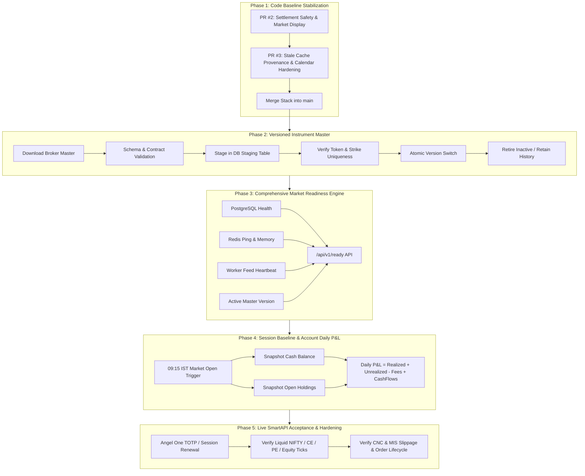

# Stock Simulator — Master Future Work Roadmap & Architecture Specification

**Document Version**: `2.0.0-PRODUCTION-ROADMAP`  
**Date**: 2026-10-01  
**Target Repository**: [https://github.com/Dhiraj10002/Stock-Simulator](https://github.com/Dhiraj10002/Stock-Simulator)  
**Status**: Authoritative Reference for Post-PR #2 / PR #3 Engineering Phases  

---

## Executive Summary & Milestone Progress

The Stock Simulator has successfully eliminated core execution vulnerabilities, stabilized CI/CD pipelines, and removed unverified data fallbacks across the market-data and order-settlement layers:

| Capability / Area | Previous Status | Current Status (PR #2 & PR #3) | Future Goal |
|---|---|---|---|
| **Virtual Paper Execution** | Position-mark fallback during feed loss | **Strict failure**: Pending intents preserved for idempotent retry | Full audit trail and exchange simulation |
| **Expiry Settlement** | Stale / wrong-session quote leakage | **Session-validated**: closing window (`15:29`–`15:30`), persistent reference table | Broker-sourced final index settlement |
| **Manual Square-off Locks** | Nested transaction deadlock risk | **Decoupled**: reservation commits before execution | Distributed locks for multi-instance |
| **Stale Quote Display** | Disappeared 2m after close; synthetic cross-leak | **Cached display**: feed-mode validated, future timestamp rejected | Persistent historical tick replay |
| **Market Desk (Dashboard)** | Hardcoded mock news, IPOs, fake GMP | **Decoupled**: Live `/news`, verified `/market/calendar`, explicit IPO unavailability | Live primary market provider integration |
| **Exchange Calendar** | Static UI list drifted from Go calendar | **Unified API**: `/api/v1/market/calendar` synced with NSE circulars | Multi-exchange (NSE + BSE) calendar control plane |
| **CI / CD Pipeline** | Cross-package test collisions, skipped integration | **Green CI**: isolated PostgreSQL/Redis, Go race gate on order accounting | Authenticated browser E2E test suite |

---

## Roadmap Phases Overview



---

## Detailed Engineering Specifications by Phase

### Phase 1: PR #2 + PR #3 Stack Consolidation

#### Objectives
1. Allow GitHub CI run `36845845632` (and any successor workflow) on PR #3 to finish completely green.
2. Confirm the commit stack:
   - PR #2 (`codex/settlement-and-market-display-20261001`): `46edc79` + `c01ff7c`
   - PR #3 (`codex/final-review-hardening-20261001`): `f0ee2b6`
3. Merge PR #3 into PR #2 branch on GitHub, then merge PR #2 into `main`.
4. Fast-forward local `main` and tag the baseline `v2.0.0-rc1`.

---

### Phase 2: Versioned Atomic Instrument Master

#### Context & Problem Statement
Currently, `python-services/market-worker/worker.py` performs in-place upserts (`_upsert_bg`) directly into the `instruments` table. If the download drops contracts, or if broker tokens are re-assigned between expiries, stale contracts can linger or collide.

#### Target Architecture
```
[Angel One OpenAPI Instruments JSON]
                │
                ▼
      ┌──────────────────┐
      │ Validation Gate  │ (Check schema, token format, segment types, tick sizes)
      └─────────┬────────┘
                │
                ▼
      ┌──────────────────┐
      │ Staging Snapshot │ (Write to instrument_snapshots with version_id = YYYYMMDD-HHMM)
      └─────────┬────────┘
                │
                ▼
      ┌──────────────────┐
      │ Integrity Check  │ (Verify unique (exchange_segment, token), valid expiries)
      └─────────┬────────┘
                │
                ▼
      ┌──────────────────┐
      │  Atomic Pointer  │ (UPDATE system_config SET active_instrument_version = '...')
      └─────────┬────────┘
                │
                ▼
      ┌──────────────────┐
      │ Soft Retirement  │ (Flag absent contracts as is_tradable = FALSE, preserve rows)
      └──────────────────┘
```

#### Database Schema Changes
```sql
-- Track instrument snapshot versions
CREATE TABLE IF NOT EXISTS instrument_snapshots (
    id BIGSERIAL PRIMARY KEY,
    version VARCHAR(64) NOT NULL UNIQUE,
    source VARCHAR(64) NOT NULL DEFAULT 'angelone_openapi',
    instrument_count INT NOT NULL,
    equity_count INT NOT NULL,
    futures_count INT NOT NULL,
    options_count INT NOT NULL,
    status VARCHAR(32) NOT NULL DEFAULT 'STAGED', -- STAGED, ACTIVE, RETIRED, FAILED
    activated_at TIMESTAMPTZ,
    created_at TIMESTAMPTZ NOT NULL DEFAULT NOW()
);

-- Index instruments by snapshot version
ALTER TABLE instruments ADD COLUMN IF NOT EXISTS snapshot_version VARCHAR(64);
ALTER TABLE instruments ADD COLUMN IF NOT EXISTS is_tradable BOOLEAN NOT NULL DEFAULT TRUE;
CREATE INDEX IF NOT EXISTS idx_instruments_version_tradable ON instruments (snapshot_version, is_tradable);
```

#### Acceptance Criteria
- [x] No contract row is ever hard deleted (preserves foreign key relations with historical orders, trades, and settlement references).
- [x] Only contracts with `is_tradable = TRUE` from the currently active version are searchable or executable in `LIVE` mode.
- [x] Expired contracts are automatically set to `is_tradable = FALSE` at 15:30 IST on their expiry date.
- [x] Staged snapshots with duplicate token detection, segment validation, and atomic version activation implemented.
- [x] Snapshot API endpoints `/instruments/snapshots/active`, `/instruments/snapshots`, `/instruments/master/status` exposed and tested.


---

### Phase 3: Comprehensive Market Readiness Engine

#### Context & Problem Statement
The current `/ready` endpoint only checks database connectivity (`pingDB`). However, if the market worker dies, if Redis is down, or if the broker feed is disconnected, `/ready` still reports 200 OK.

#### Target API Contract
`GET /api/v1/ready`

**Response Payload (HTTP 200 when ready, HTTP 503 when degraded/unready)**:
```json
{
  "ready": true,
  "status": "OPERATIONAL",
  "timestamp": "2026-10-01T15:30:00+05:30",
  "services": {
    "database": {
      "status": "UP",
      "latency_ms": 1.2,
      "connection_pool": {
        "open": 8,
        "in_use": 2,
        "idle": 6
      }
    },
    "redis": {
      "status": "UP",
      "latency_ms": 0.8,
      "mode": "CLUSTER"
    },
    "market_feed": {
      "status": "UP",
      "mode": "LIVE",
      "supervisor_state": "CONNECTED",
      "last_tick_age_seconds": 1.4,
      "subscribed_tokens_count": 1420
    },
    "instrument_master": {
      "status": "UP",
      "active_version": "20261001-0800",
      "total_tradable": 18450
    },
    "calendar": {
      "status": "UP",
      "market_state": "OPEN",
      "session_closes_at": "2026-10-01T15:30:00+05:30",
      "mis_cutoff_at": "2026-10-01T15:20:00+05:30"
    }
  }
}
```

#### Acceptance Criteria
- [ ] If Redis is unreachable, `/ready` returns HTTP 503 with `"ready": false`.
- [ ] In `LIVE` mode, if `last_tick_age_seconds > 60` during regular market hours (09:15–15:30 IST on a trading weekday), `/ready` reports degraded feed status.
- [ ] Outside market hours, aged ticks do not fail readiness; the calendar state reports `"market_state": "CLOSED"`.

---

### Phase 4: Session Baseline & Account Daily P&L Engine

#### Context & Problem Statement
Currently, `portfolio_service.go:182-185` explicitly sets `daily_pnl_paise: nil` because calculating true account daily P&L requires comparing current total equity with the account equity at session open (`09:15 IST`). Holdings Day Movement only tracks unrealized price deltas on current open positions, ignoring realized intraday gains, brokerage, fees, and cash deposits/withdrawals.

#### Mathematical Definition of Daily Account P&L
$$\text{Daily P\&L} = (\text{Current Account Value}) - (\text{Opening Account Value}) - (\text{Net Cash Inflows})$$

Where:
$$\text{Account Value} = \text{Cash Balance} + \sum (\text{Position Quantity} \times \text{LTP}) - \text{Blocked Margin Liabilities}$$

#### Implementation Architecture
1. **Cron / Background Session Snapshot**:
   At `09:15:00 IST` on every trading day (determined by `calendar.IsMarketOpen`), the session engine records an opening snapshot for every active user:
   ```sql
   CREATE TABLE IF NOT EXISTS account_daily_snapshots (
       id BIGSERIAL PRIMARY KEY,
       user_uuid UUID NOT NULL REFERENCES users(uuid),
       session_date DATE NOT NULL,
       opening_cash_paise BIGINT NOT NULL,
       opening_holdings_value_paise BIGINT NOT NULL,
       opening_equity_paise BIGINT NOT NULL,
       net_cash_inflows_paise BIGINT NOT NULL DEFAULT 0,
       created_at TIMESTAMPTZ NOT NULL DEFAULT NOW(),
       UNIQUE(user_uuid, session_date)
   );
   ```
2. **On-Demand Calculation**:
   When `GET /api/v1/portfolio` is called:
   - Check if an `account_daily_snapshots` entry exists for `session_date = TODAY`.
   - If found, compute:
     $$\text{Daily P\&L} = (\text{Current Total Value}) - (\text{opening\_equity\_paise}) - (\text{net\_cash\_inflows\_paise})$$
     $$\text{Daily P\&L \%} = \frac{\text{Daily P\&L}}{\text{opening\_equity\_paise}} \times 100$$
   - If no opening snapshot exists (e.g. new user registered today), opening equity equals initial deposit and daily P&L is calculated from registration timestamp.

#### Acceptance Criteria
- [ ] Intraday trades that are opened and closed within the same day correctly reflect in `daily_pnl_paise` via realized gains/losses.
- [ ] Deposits made during trading hours increase cash balance but do **not** artificially register as trading profit.
- [ ] Overnight positions reflect their daily change against previous session close, not their original entry price.

---

### Phase 5: Real SmartAPI Acceptance & Operational Hardening

#### Broker Entitlement & Verification Matrix
Before declaring production certification, the following matrix must be verified during an active trading session with live SmartAPI credentials:

| Asset Class | Target Instrument | Verification Item | Expected Value / Behavior |
|---|---|---|---|
| **NSE Equity** | `RELIANCE-EQ` | Segment / Token | `NSE_CM`, Token matches SmartAPI master |
| | | Price & Paise Scaling | Positive integer `rupees * 100` |
| | | Day Change & Prev Close | Matches official NSE website / Angel One app |
| **Index** | `NIFTY 50` | Stream / Snap | `SNAP_QUOTE` with non-zero LTP |
| | | Traded Flag | Not buyable as Delivery (rejected by product rules) |
| **Stock Future** | Current month `TCS` FUT | Expiry Date | Exact last Thursday of current month |
| | | Lot Size & Margin | Correct lot size (e.g. 175) & margin calculated |
| **Index Call** | Near-the-money `NIFTY` CE | Option Chain LTP | Cached quote reflects live LTP without gap |
| | | Open Interest | Authentic OI (not duplicate of volume) |
| **Index Put** | Near-the-money `NIFTY` PE | Greeks Display | Delta, Gamma, Theta labeled as model calculations |
| | | Stale Behavior | Trade disabled when connection severed |

#### Disaster Recovery & Outage Policy
- **Broker Disconnect**: Supervisor detects WebSocket timeout within 5 seconds, issues reconnect with exponential backoff (1s, 2s, 4s, max 30s), flags UI as `RECONNECTING`.
- **Feed Failure**: If reconnect fails for > 60s, frontend displays explicit amber banner `Market Data Degraded`. New market orders are rejected with `MARKET_DATA_UNAVAILABLE`.
- **Database Partition**: In-flight orders fail closed; database transactions rollback cleanly.

---

## Action Plan: Immediate Next Steps

```
[Now] ───► Monitor GitHub CI on PR #3 (Run 36845845632)
              │
              ▼ (Once Green)
          Merge PR #3 into PR #2 branch
              │
              ▼
          Merge PR #2 into main
              │
              ▼
          Implement Phase 2: Instrument Master Snapshot Architecture
              │
              ▼
          Implement Phase 3: /ready Multi-Subsystem Health Probe
              │
              ▼
          Implement Phase 4: Account Daily P&L & 09:15 Session Snapshot
              │
              ▼
          Execute Phase 5: Live SmartAPI Smoke Testing (During Market Hours)
```
