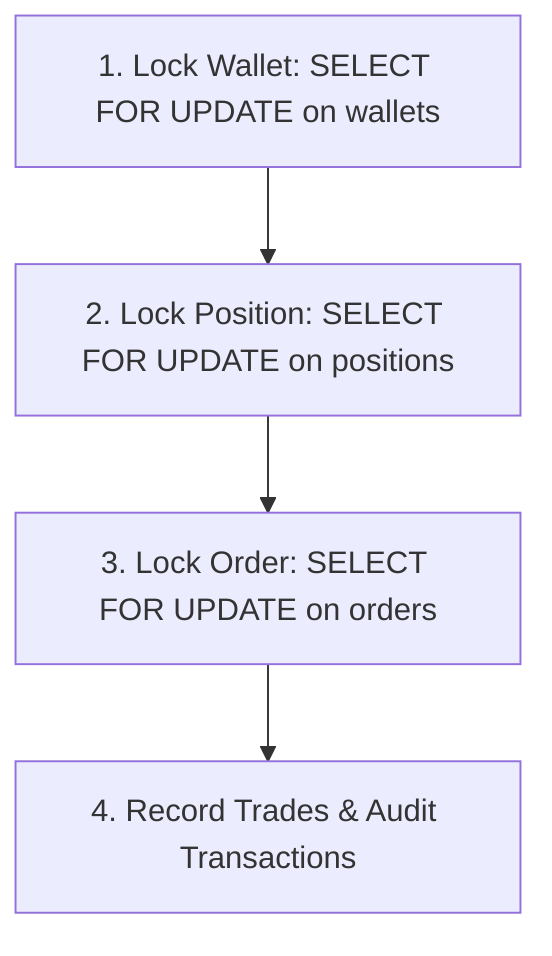
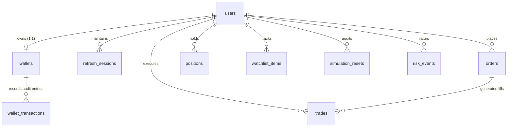
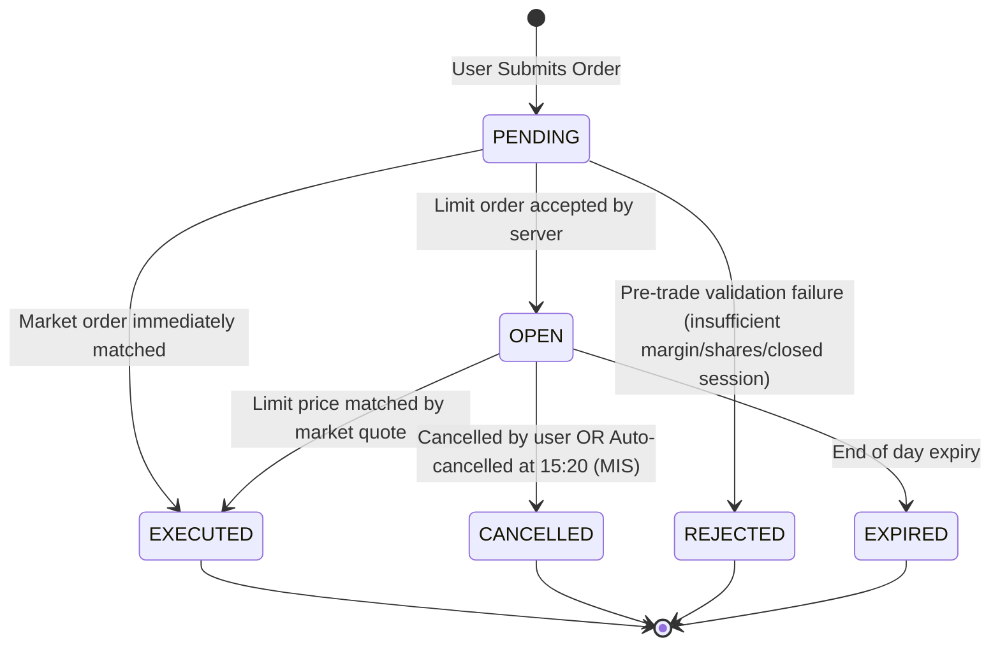
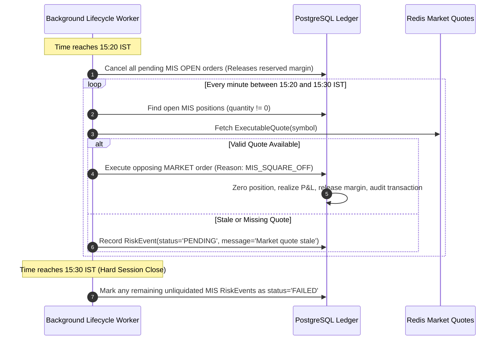
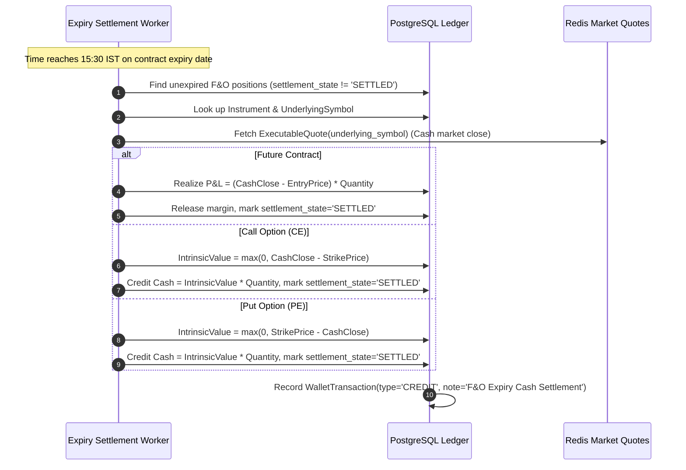

# Database Schema & Ledger Architecture

This document provides a comprehensive technical reference for the PostgreSQL database powering the **Stock Simulator** platform. It details all tables, fields, constraints, indexes, relational mappings, and state machines, with special emphasis on the **integer-paise ledger invariant** and **deadlock-free concurrency guarantees**.

---

## 1. Core Architectural & Financial Invariants

### 1.1 Integer Paise Representation (Zero Floating-Point Drift)
In accordance with Indian market financial conventions and high-precision financial accounting:
- **1 Rupee = 100 Paise**.
- All balance, price, valuation, cost basis, and margin fields are stored as **64-bit signed integers (`BIGINT` / Go `int64`)**.
- Floating-point types (`FLOAT`, `DOUBLE`, `REAL`) are strictly prohibited in database columns and Go financial arithmetic.
- Fractional paise are eliminated by tracking **exact cumulative cost basis** in paise (`cost_basis_paise`), while average price (`average_price_paise`) serves as a derived display value.

### 1.2 Deadlock-Free Concurrency & Lock Acquisition Hierarchy
To guarantee zero deadlocks under concurrent order placement, position closing, and background risk liquidations, all database transactions modifying trading state must strictly acquire row-level locks via `SELECT ... FOR UPDATE` in this exact deterministic order:



1. **`wallets`**: Always locked first by `user_uuid`. Ensures serialized margin blocks, cash debits, and credit payouts.
2. **`positions`**: Locked second by `(user_uuid, symbol, product)`. Serializes position accumulations, reductions, and crossings.
3. **`orders`**: Locked third by `id` or `uuid`. Serializes state changes (`OPEN` $\to$ `EXECUTED` / `CANCELLED`).
4. **`trades` & `wallet_transactions`**: Appended immutably within the same transaction boundary.

Never invert this sequence. Reversing the locking order (e.g., locking an order before locking a wallet) will produce PostgreSQL deadlocks (`SQLSTATE 40P01`).

### 1.3 Available Balance Formula
```
AvailableBalancePaise = CashBalancePaise - BlockedPaise
```
- Orders requiring cash or margin block verify that `RequiredPaise <= AvailableBalancePaise`.
- Margin release decrements `BlockedPaise`.
- Cash settlement credits/debits `CashBalancePaise`.

---

## 2. Entity Relationship Overview



---

## 3. Detailed Table Specifications

### 3.1 `users`
Stores registered user credentials, profile metadata, and soft-delete state.

| Column | Type | Constraints | Description |
| :--- | :--- | :--- | :--- |
| `id` | `BIGSERIAL` | `PRIMARY KEY` | Internal auto-incrementing ID |
| `uuid` | `UUID` | `NOT NULL, UNIQUE, DEFAULT gen_random_uuid()` | Public, immutable identifier |
| `name` | `VARCHAR(100)` | `NOT NULL` | User's full display name |
| `email` | `VARCHAR(255)` | `NOT NULL, UNIQUE` | User's login email address (case-insensitive indexed) |
| `password` | `TEXT` | `NOT NULL` | Argon2id / bcrypt hashed password string |
| `created_at` | `TIMESTAMPTZ` | `NOT NULL, DEFAULT NOW()` | Registration timestamp |
| `updated_at` | `TIMESTAMPTZ` | `NOT NULL, DEFAULT NOW()` | Last profile update timestamp |
| `deleted_at` | `TIMESTAMPTZ` | `NULLABLE, INDEX` | Soft-deletion timestamp (GORM managed) |

---

### 3.2 `refresh_sessions`
Maintains long-lived JWT refresh token sessions. For defense-in-depth security, raw refresh tokens are never stored; only a cryptographic hash is persisted.

| Column | Type | Constraints | Description |
| :--- | :--- | :--- | :--- |
| `id` | `BIGSERIAL` | `PRIMARY KEY` | Auto-incrementing primary key |
| `uuid` | `UUID` | `NOT NULL, UNIQUE, DEFAULT gen_random_uuid()` | Session identifier |
| `user_uuid` | `UUID` | `NOT NULL, INDEX` | Reference to `users.uuid` |
| `token_hash` | `VARCHAR(64)` | `NOT NULL, UNIQUE` | SHA-256 hash of the issued refresh token |
| `expires_at` | `TIMESTAMPTZ` | `NOT NULL` | Refresh session expiration boundary |
| `revoked_at` | `TIMESTAMPTZ` | `NULLABLE, INDEX` | Timestamp when session was revoked / logged out |
| `created_at` | `TIMESTAMPTZ` | `NOT NULL, DEFAULT NOW()` | Token issue timestamp |

---

### 3.3 `wallets`
The master ledger representing a user's virtual capital in paise.

| Column | Type | Constraints | Description |
| :--- | :--- | :--- | :--- |
| `id` | `BIGSERIAL` | `PRIMARY KEY` | Primary key |
| `uuid` | `UUID` | `NOT NULL, UNIQUE, DEFAULT gen_random_uuid()` | Public wallet identifier |
| `user_uuid` | `UUID` | `NOT NULL, UNIQUE` | Strict 1:1 association to `users.uuid` |
| `cash_balance_paise` | `BIGINT` | `NOT NULL, DEFAULT 0` | Total liquid cash balance in paise |
| `blocked_paise` | `BIGINT` | `NOT NULL, DEFAULT 0` | Reserved margin and pending order funds in paise |
| `created_at` | `TIMESTAMPTZ` | `NOT NULL, DEFAULT NOW()` | Wallet creation timestamp |
| `updated_at` | `TIMESTAMPTZ` | `NOT NULL, DEFAULT NOW()` | Last ledger modification timestamp |

**Default Initial Credit**: New registrations receive an initial paper balance of ₹1,000,000 (`100_000_000` paise).

---

### 3.4 `wallet_transactions`
An immutable, double-entry audit log for every change to `cash_balance_paise` or `blocked_paise`.

| Column | Type | Constraints | Description |
| :--- | :--- | :--- | :--- |
| `id` | `BIGSERIAL` | `PRIMARY KEY` | Primary key |
| `uuid` | `UUID` | `NOT NULL, UNIQUE, DEFAULT gen_random_uuid()` | Audit transaction identifier |
| `wallet_uuid` | `UUID` | `NOT NULL, INDEX` | Reference to `wallets.uuid` |
| `type` | `VARCHAR(30)` | `NOT NULL, INDEX` | Transaction category (see enum below) |
| `amount_paise` | `BIGINT` | `NOT NULL` | Magnitude of the transaction in paise |
| `balance_paise` | `BIGINT` | `NOT NULL` | Resulting `cash_balance_paise` after event |
| `blocked_paise` | `BIGINT` | `NOT NULL, DEFAULT 0` | Resulting `blocked_paise` after event |
| `note` | `VARCHAR(255)` | `NULLABLE` | Human/system readable audit explanation |
| `created_at` | `TIMESTAMPTZ` | `NOT NULL, DEFAULT NOW()` | Timestamp of transaction occurrence |

**Transaction Types**:
- `INITIAL_CREDIT`: Starting virtual capital allocation upon user onboarding.
- `CREDIT`: Realized trading profit, position square-off cash return, or option exercise payout.
- `DEBIT`: Equity purchase cash outflow or realized trading loss.
- `RESERVE`: Funds or margin temporarily locked for pending limit orders.
- `RELEASE`: Blocked funds returned upon order cancellation, fill adjustments, or position liquidation.
- `RESET`: Portfolio reset event restoring starting virtual balance.

---

### 3.5 `positions`
Maintains open and historically closed positions across Delivery (`CNC`), Intraday (`MIS`), and Derivatives (`NRML`).

| Column | Type | Constraints | Description |
| :--- | :--- | :--- | :--- |
| `id` | `BIGSERIAL` | `PRIMARY KEY` | Primary key |
| `uuid` | `UUID` | `NOT NULL, UNIQUE, DEFAULT gen_random_uuid()` | Public position identifier |
| `user_uuid` | `UUID` | `NOT NULL, INDEX` | Reference to `users.uuid` |
| `symbol` | `VARCHAR(30)` | `NOT NULL, INDEX` | Trading symbol (e.g., `RELIANCE`, `NIFTY26SEP24000CE`) |
| `product` | `VARCHAR(15)` | `NOT NULL, INDEX, DEFAULT 'DELIVERY'` | Product type: `DELIVERY`, `INTRADAY`, `FNO` |
| `instrument_type` | `VARCHAR(40)` | `NULLABLE` | `EQUITY`, `FUTSTK`, `FUTIDX`, `OPTSTK`, `OPTIDX` |
| `underlying_symbol` | `VARCHAR(80)` | `NULLABLE` | Underlying cash symbol for derivatives (e.g., `NIFTY`) |
| `quantity` | `BIGINT` | `NOT NULL, DEFAULT 0` | Current held units (positive = Long, negative = Short) |
| `average_price_paise` | `BIGINT` | `NOT NULL, DEFAULT 0` | Weighted average entry price in paise (display metric) |
| `cost_basis_paise` | `BIGINT` | `NOT NULL, DEFAULT 0` | Exact remaining acquisition cost basis in paise |
| `realized_pnl_paise` | `BIGINT` | `NOT NULL, DEFAULT 0` | Cumulative realized profit/loss in paise |
| `margin_blocked_paise` | `BIGINT` | `NOT NULL, DEFAULT 0` | Active margin reserved in wallet for this position |
| `square_off_state` | `VARCHAR(20)` | `NULLABLE` | MIS square-off tracking: `PENDING`, `COMPLETED` |
| `settlement_state` | `VARCHAR(20)` | `NULLABLE, INDEX` | F&O expiry tracking: `PENDING`, `SETTLED` |
| `current_price_paise` | `BIGINT` | `NOT NULL, DEFAULT 0` | Last recorded market valuation price in paise |
| `created_at` | `TIMESTAMPTZ` | `NOT NULL, DEFAULT NOW()` | Position creation timestamp |
| `updated_at` | `TIMESTAMPTZ` | `NOT NULL, DEFAULT NOW()` | Last position update timestamp |

**Valuation Formulas**:
- **Invested Value**: `InvestedValuePaise = cost_basis_paise` (falls back to `quantity * average_price_paise` for legacy rows).
- **Current Value**: `CurrentValuePaise = quantity * current_price_paise`.
- **Unrealized P&L**: `UnrealizedPnlPaise = CurrentValuePaise - InvestedValuePaise`.

---

### 3.6 `orders`
The authoritative registry of all order submissions and state machine transitions.

| Column | Type | Constraints | Description |
| :--- | :--- | :--- | :--- |
| `id` | `BIGSERIAL` | `PRIMARY KEY` | Primary key |
| `uuid` | `UUID` | `NOT NULL, UNIQUE, DEFAULT gen_random_uuid()` | Public order identifier |
| `user_uuid` | `UUID` | `NOT NULL, INDEX` | Submitting user's UUID |
| `symbol` | `VARCHAR(30)` | `NOT NULL, INDEX` | Target instrument symbol |
| `side` | `VARCHAR(10)` | `NOT NULL` | `BUY` or `SELL` |
| `type` | `VARCHAR(10)` | `NOT NULL` | `MARKET` or `LIMIT` |
| `product` | `VARCHAR(15)` | `NOT NULL` | `DELIVERY`, `INTRADAY`, `FNO` |
| `quantity` | `BIGINT` | `NOT NULL` | Order volume in shares or lot multiple units |
| `price_paise` | `BIGINT` | `NOT NULL, DEFAULT 0` | Limit price in paise (0 for MARKET) |
| `executed_price_paise`| `BIGINT` | `NOT NULL, DEFAULT 0` | Server-authoritative fill price in paise |
| `reserved_paise` | `BIGINT` | `NOT NULL, DEFAULT 0` | Wallet amount held in `blocked_paise` while pending |
| `source` | `VARCHAR(16)` | `NOT NULL, DEFAULT 'USER'` | Submitter origin: `USER` or `SYSTEM` |
| `reason` | `VARCHAR(40)` | `NULLABLE` | System reason: `MIS_SQUARE_OFF`, `FNO_EXPIRY_SETTLEMENT` |
| `status` | `VARCHAR(20)` | `NOT NULL, INDEX` | Order lifecycle status (see State Machine) |
| `created_at` | `TIMESTAMPTZ` | `NOT NULL, DEFAULT NOW()` | Order submission timestamp |
| `updated_at` | `TIMESTAMPTZ` | `NOT NULL, DEFAULT NOW()` | Last order transition timestamp |

---

### 3.7 `trades`
Immutable trade execution records generated upon order matching or forced liquidation.

| Column | Type | Constraints | Description |
| :--- | :--- | :--- | :--- |
| `id` | `BIGSERIAL` | `PRIMARY KEY` | Primary key |
| `uuid` | `UUID` | `NOT NULL, UNIQUE, DEFAULT gen_random_uuid()` | Unique execution ticket ID |
| `order_uuid` | `UUID` | `NOT NULL, INDEX` | Originating `orders.uuid` |
| `user_uuid` | `UUID` | `NOT NULL, INDEX` | Account holder `users.uuid` |
| `symbol` | `VARCHAR(30)` | `NOT NULL, INDEX` | Traded instrument symbol |
| `side` | `VARCHAR(10)` | `NOT NULL` | Execution side: `BUY` or `SELL` |
| `quantity` | `BIGINT` | `NOT NULL` | Executed quantity |
| `price_paise` | `BIGINT` | `NOT NULL` | Fill price in paise |
| `total_paise` | `BIGINT` | `NOT NULL` | Gross trade turnover (`quantity * price_paise`) |
| `product` | `VARCHAR(15)` | `NOT NULL, DEFAULT 'DELIVERY'`| `DELIVERY`, `INTRADAY`, `FNO` |
| `source` | `VARCHAR(16)` | `NOT NULL, DEFAULT 'USER'` | Execution initiator: `USER` or `SYSTEM` |
| `reason` | `VARCHAR(40)` | `NULLABLE` | Automated trigger reason |
| `realized_pnl_paise` | `BIGINT` | `NOT NULL, DEFAULT 0` | Realized P&L in paise (0 for buys; exact delta for sells) |
| `executed_at` | `TIMESTAMPTZ` | `NOT NULL, DEFAULT NOW()` | Execution timestamp |

---

### 3.8 `instruments`
The daily instrument master synced from Angel One's instrument feed. Enables search, symbol validation, lot sizes, and derivative resolution.

| Column | Type | Constraints | Description |
| :--- | :--- | :--- | :--- |
| `id` | `BIGSERIAL` | `PRIMARY KEY` | Primary key |
| `token` | `VARCHAR(32)` | `NOT NULL` | Angel One instrument token |
| `symbol` | `VARCHAR(80)` | `NOT NULL, INDEX` | Market symbol |
| `name` | `VARCHAR(160)` | `NOT NULL, INDEX` | Company / index legal name |
| `underlying_symbol` | `VARCHAR(80)` | `NULLABLE, INDEX` | Cash market reference for options/futures |
| `expiry` | `VARCHAR(32)` | `NULLABLE` | Expiration date string (`YYYY-MM-DD`) |
| `strike` | `VARCHAR(32)` | `NULLABLE` | Option strike price in Rupee string format |
| `option_type` | `VARCHAR(8)` | `NULLABLE` | `CE` (Call) or `PE` (Put) |
| `lot_size` | `BIGINT` | `NOT NULL, DEFAULT 0` | Minimum tradable contract lot size |
| `instrument_type` | `VARCHAR(40)` | `NULLABLE` | `EQUITY`, `FUTIDX`, `OPTIDX`, `FUTSTK`, `OPTSTK` |
| `exchange_segment` | `VARCHAR(16)` | `NOT NULL, INDEX` | Exchange segment: `NSE`, `BSE`, `NFO` |
| `tick_size` | `VARCHAR(32)` | `NULLABLE` | Minimum price fluctuation |
| `created_at` | `TIMESTAMPTZ` | `NOT NULL, DEFAULT NOW()` | Ingestion timestamp |
| `updated_at` | `TIMESTAMPTZ` | `NOT NULL, DEFAULT NOW()` | Last update timestamp |

**Composite Unique Index**: `idx_instruments_token_exchange` ON `(token, exchange_segment)`.

---

### 3.9 `risk_events`
Audit log recording automated risk manager interventions, unexecutable auto-squareoffs, and derivative settlement failures.

| Column | Type | Constraints | Description |
| :--- | :--- | :--- | :--- |
| `id` | `BIGSERIAL` | `PRIMARY KEY` | Primary key |
| `uuid` | `UUID` | `NOT NULL, UNIQUE, DEFAULT gen_random_uuid()` | Public event identifier |
| `user_uuid` | `UUID` | `NOT NULL, INDEX` | Target user account |
| `symbol` | `VARCHAR(80)` | `NOT NULL, INDEX` | Instrument symbol |
| `product` | `VARCHAR(15)` | `NOT NULL, INDEX` | `INTRADAY` or `FNO` |
| `event_type` | `VARCHAR(40)` | `NOT NULL, INDEX` | Action: `MIS_SQUARE_OFF`, `FNO_EXPIRY_SETTLEMENT` |
| `status` | `VARCHAR(20)` | `NOT NULL, INDEX` | Lifecycle: `PENDING`, `EXECUTED`, `FAILED`, `RESOLVED` |
| `message` | `VARCHAR(500)` | `NOT NULL` | Detailed diagnostic or error log |
| `created_at` | `TIMESTAMPTZ` | `NOT NULL, DEFAULT NOW()` | Timestamp of risk event |

---

### 3.10 `simulation_resets`
Immutable pre-reset audit snapshots captured immediately before clearing a user's portfolio state.

| Column | Type | Constraints | Description |
| :--- | :--- | :--- | :--- |
| `id` | `BIGSERIAL` | `PRIMARY KEY` | Primary key |
| `uuid` | `UUID` | `NOT NULL, UNIQUE, DEFAULT gen_random_uuid()` | Snapshot record ID |
| `user_uuid` | `UUID` | `NOT NULL, INDEX` | Account holder |
| `initial_balance_paise` | `BIGINT` | `NOT NULL` | Baseline balance restored to wallet |
| `previous_cash_paise` | `BIGINT` | `NOT NULL` | Cash balance immediately prior to reset |
| `previous_blocked_paise`| `BIGINT` | `NOT NULL` | Blocked margin immediately prior to reset |
| `invested_value_paise` | `BIGINT` | `NOT NULL` | Total cost basis of holdings liquidated |
| `current_value_paise` | `BIGINT` | `NOT NULL` | Market valuation of holdings liquidated |
| `unrealized_pnl_paise` | `BIGINT` | `NOT NULL` | Unrealized P&L wiped out during reset |
| `cancelled_order_count` | `BIGINT` | `NOT NULL` | Number of open orders purged |
| `cleared_position_count`| `BIGINT` | `NOT NULL` | Number of positions cleared |
| `created_at` | `TIMESTAMPTZ` | `NOT NULL, DEFAULT NOW()` | Timestamp of reset execution |

---

### 3.11 `watchlist_items`
User-curated watchlists for streaming real-time quotes.

| Column | Type | Constraints | Description |
| :--- | :--- | :--- | :--- |
| `id` | `BIGSERIAL` | `PRIMARY KEY` | Primary key |
| `uuid` | `UUID` | `NOT NULL, UNIQUE, DEFAULT gen_random_uuid()` | Watchlist entry identifier |
| `user_uuid` | `UUID` | `NOT NULL` | User identifier |
| `symbol` | `VARCHAR(80)` | `NOT NULL` | Symbol tracked |
| `created_at` | `TIMESTAMPTZ` | `NOT NULL, DEFAULT NOW()` | Add timestamp |

**Composite Unique Index**: `idx_watchlist_user_symbol` ON `(user_uuid, symbol)`.

---

## 4. State Machines & Lifecycle Transitions

### 4.1 Order State Machine



### 4.2 MIS Intraday Auto-Squareoff Lifecycle (15:20 – 15:30 IST)



### 4.3 F&O Expiry Settlement Lifecycle (15:30 IST on Expiry Day)



---

## 5. Indexing Strategy & Performance Tuning

1. **Composite Provider Uniqueness**:
   - `idx_instruments_token_exchange` on `instruments(token, exchange_segment)` prevents collisions between identically numbered tokens on different exchanges.
2. **Watchlist Collision Prevention**:
   - `idx_watchlist_user_symbol` on `watchlist_items(user_uuid, symbol)` enforces unique favorites per user.
3. **High-Frequency Ledger Lookups**:
   - Indexes on `orders(user_uuid, status)`, `positions(user_uuid, product)`, and `wallet_transactions(wallet_uuid, created_at DESC)` guarantee sub-millisecond retrieval during portfolio dashboard queries and high-frequency trade matching.
