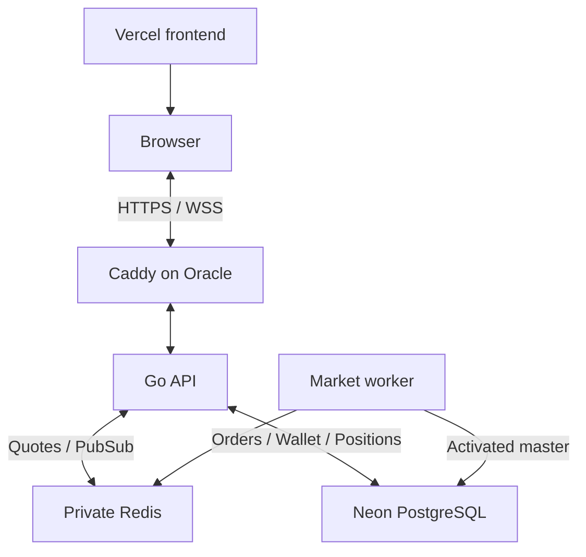

# Production deployment: Vercel + Oracle

The V1 production stack is Next.js on Vercel, Caddy/Go/Python workers/private Redis on an Oracle VM, and Neon PostgreSQL for durable trading state. `docker-compose.prod.yml` is the source of truth. Development may use managed Redis; production Compose deliberately uses `redis://redis:6379/0`. Upstash requires a separate, measured migration of the URL and local-service dependencies.



News processing remains a private worker. Redis is a cache and live event bus; PostgreSQL remains the financial authority. Redis Pub/Sub does not replay missed events, so reconnect snapshots and the existing display fallback remain necessary.

## Prerequisites

- Oracle Linux VM with Docker Engine, Compose **2.24 or newer**, Python 3 and outbound access to Neon, the broker and certificate authorities. Build images for the VM's actual architecture; an Ampere A1 VM requires ARM-compatible builds.
- A DNS-only API hostname such as `api.your-domain.com` pointing to the VM. Configure AAAA only if IPv6 routing works. Caddy is the first public proxy in this setup; adding another CDN/proxy requires reviewing the trusted client-IP chain.
- Public ingress for TCP 80/443; UDP 443 is optional for HTTP/3. Restrict SSH to operator access. Go 8080, worker 8085 and Redis 6379 have no host port mappings. The optional frontend container binds 3000 to loopback only.
- Neon production connection URI with TLS (`sslmode=require`), a generated JWT signing secret, and the actual frontend origin. Choose nearby regions and measure warm/cold DB latency; worker refreshes can keep Neon compute active.
- Real `ANGEL_API_KEY`, `ANGEL_CLIENT_ID`, `ANGEL_PASSWORD` and `ANGEL_TOTP_SECRET` for LIVE mode. Production credentials belong only on Oracle, never in Vercel public variables or Git.

## One production environment file

From the repository root:

```bash
cp .env.prod.example .env
chmod 600 .env
# Edit .env: replace domain/origin/database/secret/broker placeholders.
```

Generate `JWT_SECRET` with `openssl rand -hex 32`. Use the repository-root `.env` for both Compose interpolation and application container environment. Production does not merge `backend/.env`; that file is for native development. Shell variables override Compose interpolation, so remove stale exported values before deploying.

| Setting | Value/purpose |
|---|---|
| `API_DOMAIN` | API DNS hostname, without scheme, port or path |
| `ACME_EMAIL` | Contact for automatic HTTPS certificates |
| `DATABASE_URL` | Neon production TLS URI |
| `JWT_SECRET` | Generated secret, at least 32 bytes; placeholders are rejected |
| `CORS_ALLOWED_ORIGINS` | Exact frontend origin; comma-separated explicit origins when needed |
| `MARKET_FEED_MODE` | `live`; keep synthetic execution flags false |
| `CADDY_INTERNAL_IP` | Default `172.30.250.2` on the dedicated gateway bridge |
| `GATEWAY_SUBNET` | Default `172.30.250.0/29`; change together with Caddy IP and dynamic range if overlapping another network |
| `GATEWAY_DYNAMIC_RANGE` | Default `172.30.250.4/30`; excludes Caddy's fixed IP so backend/one-off starts cannot claim it |
| `PRODUCTION_ENV_FILE` | Optional alternate env-file path; bootstrap passes it to interpolation and containers |

Compose fixes the backend internal port to 8080, derives `TRUSTED_PROXIES` from the Caddy IP, and fixes all three application services to the private Redis URL. Without production Compose, `TRUSTED_PROXIES` defaults to empty: forwarding headers are ignored. Only literal IPs/bounded CIDRs are accepted; wildcard and `/0` allowlists are rejected.

Do not print rendered `docker compose config` output into shared logs: it contains secrets. This preflight validates without displaying it:

```bash
docker compose -f docker-compose.prod.yml config --quiet
```

## First launch and subsequent releases

After DNS and `.env` are configured:

```bash
python3 scripts/bootstrap_production.py --sync-master
```

The bootstrap validates configuration, then:

1. Builds/starts Redis, Go backend and Caddy, waiting for container health.
2. Verifies public HTTPS `/health`. Backend health reports process liveness, not trading readiness.
3. Runs the official master synchronizer and verifies a non-empty activated snapshot.
4. Builds/starts market and news workers after activation.
5. Waits for public `/ready` to report `ready: true`.

Missing master, failed sync or health/readiness timeout makes the command exit unsuccessfully. It does not stop existing containers or roll back database changes. Investigate the cause with Compose status/logs. Missing authoritative prices still block LIVE execution; do not switch to synthetic mode to make readiness green.

For a later release using an already activated master:

```bash
python3 scripts/bootstrap_production.py
```

Use `--sync-master` when intentionally refreshing the official master. A healthy `/ready` does not replace open-market acceptance of delivery, intraday, futures/options, exits and wallet/P&L reconciliation. Budget extra initialization time with `--timeout 300` when needed.

For an alternate env file:

```bash
python3 scripts/bootstrap_production.py --env-file /secure/path/production.env --sync-master
```

Use the same file for later manual Compose operations: set `PRODUCTION_ENV_FILE=/secure/path/production.env` and pass `--env-file /secure/path/production.env`.

## Gateway and client identity

Caddy runs inside Compose, persists certificate state in `caddy_data`/`caddy_config`, and forwards to Docker DNS name `backend:8080`. It belongs to `gateway_net`; only Go also joins this bridge. Workers and Redis stay on the application bridge. The backend has no published port, including loopback.

Caddy replaces incoming `X-Forwarded-*` values by default. Go accepts `X-Forwarded-For` only from the configured Caddy address and ignores `X-Real-IP`. This gives anonymous users separate rate-limit buckets and prevents browsers/untrusted containers from choosing their own identity. Do not replace the exact gateway allowlist with a broad public/private network allowlist.

The gateway serves `/api/*`, `/ws/*`, `/health`, `/ready` and `/openapi.yaml`; WebSocket upgrades are automatic. API/health/readiness responses use `Cache-Control: no-store`. Compression applies to eligible HTTP responses. Certificate volumes must survive normal container replacements; `down --volumes` deletes them and Redis data and is not a normal release command.

## Vercel frontend

Import the repository with root directory `frontend` and the normal Next.js framework build. Configure these **at build time**, then redeploy:

```dotenv
NEXT_PUBLIC_API_URL=https://api.your-domain.com/api/v1
NEXT_PUBLIC_WS_URL=wss://api.your-domain.com/ws/market
```

Only these public endpoint URLs belong in frontend configuration. Put the deployed frontend origin in Oracle's `CORS_ALLOWED_ORIGINS`; add a specific staging origin when testing previews. Browser API/WSS traffic connects directly to Caddy.

The existing homepage/UI is preserved. Standalone output optimizes the optional Docker frontend runtime; Vercel uses its normal framework deployment. See [mobile profiling and standalone verification](mobile-polling-standalone.md). After staging is live:

```bash
cd frontend
npm run profile:mobile -- --url https://YOUR_FRONTEND_HOST --paths /,/login --runs 3
```

## Verification and release operations

```bash
docker compose -f docker-compose.prod.yml ps
# Internal process liveness, without publishing backend 8080:
docker compose -f docker-compose.prod.yml exec -T backend /healthcheck
# Real public readiness, including worker/master/feed checks:
curl --fail --max-time 15 https://api.your-domain.com/ready
```

Confirm allowed frontend REST/CORS and WSS, token refresh, stale-feed/reconnect behavior, and absence of public 8080/8085/6379. Verify NSE and NFO session boundaries separately. Record release SHA, schema state and active master version; verify database backup/restore and migration-compatible rollback before promoting staging.

The CI `Production Gateway HTTPS and WSS Smoke` runs the actual Caddy/Go/Redis stack with disposable local PostgreSQL and a trusted localhost test CA. It checks HTTPS redirects, WSS ping/reconnect/origin rejection, header spoofing/rate limits, no host ports on private services, no-store headers and readiness remaining 503 without a LIVE worker. It never uses broker credentials or places orders. On a **disposable Docker host with free 80/443**, run:

```bash
python3 scripts/smoke_production_gateway.py
```

The PostgreSQL override `deploy/oracle/docker-compose.smoke.yml` is test-only. Do not include it in production. CI validates gateway behavior; public DNS/certificate issuance, Oracle networking and real broker acceptance still require staging verification.

Local development remains `docker compose up --build`, or `docker compose --profile local up --build` for local PostgreSQL/Redis. Native Linux/Fedora startup uses `./start-dev.sh`; see [backend startup performance](backend-startup-performance.md).
